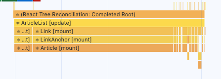

## Prologue

프론트엔드라는 개발 분야가 등장한 이후 빠르게 발전되어 웹 개발은 곧 프론트엔드이다. 라고 할 정도의 입지가 단단해졌다.

앵귤러라는 프레임워크가 등장했고 리액트가 등장 그 이후로 뷰(Vue)가 등장했고 지금도 또한 빠르게 발전되고 있다.

다만 최근은 **성능 최적화** 라는 주제에 관심을 갖기 시작했다.

구글은 오래전부터 웹 성능에 대해 관심을 가져 왔고 다양한 시도를 헀다.
그 과정에서 Lighthouse AMP 같은 기술이 나오기도 하였고

구글은 계속해서 관심을 가지고 노력중이다.

구글은 성능이 저하되면 사용자가 떠나고 매출이 감소한다. 라고 주장하고있다.


핀터레스트는 로딩 시간을 40% 줄임으로써 검색 유입률과 가입자 수를 15% 늘렸다고 한다.

웹 성능을 최적화하면 서비스 사용자에게 더 나은 사용자 경험을 제공할 수 있으며 가입률과 전환율을 높이고 이탈율을 낮춰 더 많은 수익을 창출할 수 있다고 한다.


## 성능 최적화는 어떻게 이루어 지는가.

웹 성능을 결정하는 요소는 크게 로딩 성능과 렌더링 성능으로 나뉜다.

로딩 성능은 서버에 있는 웹 페에지에 필요한 기타 리소스를 다운로드할 떄의 성능을 말한다.

고화질 이미지가 포함되어 있을 때 느린 인터넷 환경에서는 이 이미지가 매우 늦게 표현될 것이다.

마찬가지로 HTML, JS, CSS 파일의 크기가 커지면 커질수록 다운로드의 속도가 느려질 것이다.

로딩 성능을 개선하는 좋은 방법은 다운로드해야 하는 리소스 수를 줄이거나 크기를 줄이는 것이다.

아니라면 코드를 분할하여 다운로드하거나 리소스의 우선순위를 매겨 중요한 리소스를 먼저 다운로드하도록 하는 방법이 있다.

## 렌더링 성능

렌더링 성능은 다운로드한 리소스를 가지고 화면을 그릴 떄의 성능을 말한다.

코드를 실행하여 보여 주는 과정을 떠올리면 된다.

렌더링 성능에 크게 영향을 주는 것은 **자바스크립트 코드**이다.

코드를 얼마나 효율적으로 작성했는냐에 따라 화면이 그려지는 속도와 사용자 인터렉션의 자연스러움이 달라진다.

---

## 블로그 서비스 최적화

블로그 서비스는

- 블로그 글 목록 페이지
- 상세 페이지

두 가지로 구성되어 있다.

단순해 보이지만 최적화가 필요한 몇 가지 포인트가 있다.

블로그 서비스를 하나하나 분석하고 뜯어 보면서 최적화 이론과 기법을 배워 볼 수 있을 것이다.

### 이미지 사이즈 최적화

웹 서비스에 매우 다양한 이미지를 사용한다. 하지만 너무 큰 사이즈의 이미지를 무분별하게 사용하면 네트워크 트래픽이 증가해 서비스 로딩이 오래 걸린다.

어떤 이미지 사이즈가 적절한지 살펴보고 블로그 사이트에 적용하여 성능을 높여 보자.

### 코드 분할

코드 분할 기법은 리액트 개발자라면 들어 봤을 것이다. 말 그대로 코드를 분할하는 기법이다. SPA의 특성상
모든 리액트 코드가 하나의 자바스크립트 파일로 번들링되어 로드되기 때문에 첫 페이지 진입 시 당장 사용하지 않는 코드가 다소 포함되어 있다.

이떄 코드 분할을 통해서 필요 없는 코드를 때어 내고 해당 코드를 필요한 시점에 따로 로드할 수 있다.

### 텍스트 압축

웹 페이지에 접속하면 다양한 리소스를 내려받는다. 그 중에는 HTML, CSS, JS 등이 포함되어 있는데

이런 리소스는 다운로드 전에 서버에서 미리 압축할 수 있다. 그러면 원래 사이즈보다 더 작은 사이즈로 다운로드 할 수 있어 빠르게 로드 가능하다.

### 병목 코드 최적화

특정 자바스크립트 코드 떄문에 서비스가 느리게 실행되는 경우가 있다. 어떤 코드가 무엇 떄문에 느린지 몰라서 코드만 보며 한참을 해매는 떄도 있다.

이처럼 서비스를 느리게 만드는 코드를 병목 코드라고 부른다.

### webpack-bundle-analyzer

분석 툴 중에 잘 사용하고 있지 않은 툴이 있어 적어보았다.

크롬 개발자 도구에 있는 툴이 아닌 직접 설치해야 하는 툴이다. webpack 을 통해 번들링된 파일이 어떤 코드 즉 어떤 라이브러리를 담고 있는지 보여준다.

이 툴을 사용해 최종적으로 완성된 번들 파일 중 불필요한 코드가 어떤 코드이고 번들 파일에서 어느 정도의 비중을 차지하고 있는지 확인 가능하다.

--------

## 실행까지의 페이지 생략

----

### Lighthouse 툴을 이용한 페이지 검사

Lighthouse 로 검사하기.


저는 책에 나오는 47점 까지는 아니고 70점 중반까지 나왔습니다.


### FCP (First Contentful Paint)

FCP 는 페이지가 로드될 때 브라우저가 DOM 콘텐츠의 첫 번째 부분을 렌더링 하는데 걸리는 시간에 관한 지표이다.

저 같은 경우는 1.2초 걸렸네용 ㅎㅎ. 인터넷이 좋았나보다~

### SI (Speed Index)

페이지 로드 중에 콘텐츠가 시각적으로 표시되는 속도를 나타내는 지표이다.
전체 화면을 렌더링하는데 똑같이 4s 초의 시간이 걸려도

밑 사진과 같이 일부 페이지가 로딩을 먼저 시작하면 더 빨리 로드된 것으로 계산되며 높은 점수(10% 가중)를 받는다고 한다.


### LCP (Largest Contentful Paint)

LCP는 페이지가 로드될 때 화면 내에 있는 가장 큰 이미지나 텍스트 요소가 렌더링되기까지 걸리는 시간을 나타내는 지표이다.
저는 3.1 s초 걸렸네요..

### TTI (Time to Interative)

TTI 는 사용자가 페이지와 상호 작용 가능한 시점까지 걸리는 시간을 측정한 지표이다.

클릭 또는 키보드 누름 같은 사용자 입력을 의미한다.

### TBT (Total Blocking Time)

페이지가 클릭 키보드 입력 등의 사용자 입력에 응답하지 않도록 차단된 시간을 총합한 지표이다.

FCP 와 TTI 사이의 시간 동안 일어나며 메인 스레드를 독점하여 다른 동작을 방해하는 작업에 걸린 시간을 총합한다.

### CLS (Cumulative Layout Shift)

페이지 로드 과정에서 발생하는 예기치 못한 레이아웃 이동을 측정한 지표이다.

화면상에서 요소의 위치나 크기가 순간적으로 변하는 것을 의미한다.

-----------------

Lighthouse 결과를 보면 Opportunities 라는 섹션과 Diagnostics 라는 섹션이 있다.

이 두 섹션은 웹 페이지의 문제점과 해결 방안, 문제를 해결해서 얻을 수 있는 이점이 무엇인지 보여준다.

### Opportunities

Opportunities 섹션은 페이지를 더욱 빨리 로드하는 데 잠재적으로 도움되는 제안을 나열

### Diagnostics

로드 속도와 직접적인 관계는 없지만 성능과 관련된 기타 정보를 보여준다.


Emulated DeskTop Power, Custom throttling 에 추가적인 정보를 얻을 수 있다.

-------

### 이미지 사이즈 최적화

Opportunities 섹션의 첫 번째 항목에 Properly size images 가 있다.
이는 이미지를 적절한 사이즈로 사용하도록 제안하고 있다.


난 그냥 Diagnostics 에서 나오던데..?

펼처서 내용을 보면 적절하지 않은 사이즈의 이미지의 리스트를 보여준다.

이 검사 결과에서 제안하는 방법은 이미지를 적절한 사이즈로 바꿔라 라고 한다.

바꾸었을 때 어느정도의 리턴이 있을 것인지도 보여준다.

또한 "요소" 패널로 이동해서 웹 페이지의 이미지 요소를 검사했을 때

실제 이미지의 해상도와 사용하고 있는 해상도의 비교도 가능하다.

------------------

이미지가 크게 불러와 지는것을 확인했다면 어떻게 줄여야 하는가.

만약 정적 이미지 파일이었다면 그냥 사이즈를 줄여서 보여주면 끝이지만

API 를 통해 이미지를 가져온다면 다른 방법을 사용해야 할 것이다.

교재에서 나오는 내용은 다음과 같다.

### 이미지 CDN

CDN (Content Delivery Network) 이란 물리적 거리의 한계를 극복하기 위해
소비자와 가까운 곳에 콘텐츠 서버를 두는 기술을 의미한다.

만약 한국에 있는 사용자가 미국에 있는 서버에서 이미지를 다운로드 하는 경우 물리적 거리가 상당하기 떄문에
시간이 오래 걸릴 것이다.

CDN 을 사용해서 이미지를 사용자에게 보내기 전에 특정 형태로 가공하여 전해주는 기능이 있다.

이미지 사이즈를 줄이거나, 특정 포맷으로 변경하는 작업이 가능하다.

일반적인 이미지 CDN 에서 제공하는 주소는 다음과 같이 이루어져 있다.

http://cdn.image.com?src=[img src]&width=240&height=240

위와 같이 이미지 CDN 서버의 주소에 쿼리스트링으로 가져올 이미지의 주소 또는 이름을 입력한다.

내가 원하는 사이즈도 width, height 로 따로 설정 가능하다.

하지만 이번 실습에서는 이런 식으로 만들지는 않는다고 한다.

실습 파일을 보면

```typescript
function getParametersForUnsplash({width, height, quality, format}) {
  return `?w=${width}&h=${height}&q=${quality}&fm=${format}&fit=crop`
}
```

이런 함수가 있다. 쿼리를 붙이면 그 쿼리를 기반으로 아미지 사이즈가 결정되는것을 추측할 수 있다.

실제로 해당 이미지의 1200의 숫자를 240까지 줄이면 방금까지 나온 이미지 크기가 너무 크다는
Lighthouse의 경고가 사라진다.

------------------

### 병목 코드 최적화

Reduce JavaScript execution time <- 이라 하는데..
저는 안나오더라구요?

교재 내에서 항목을 보면 1.365 정도의 자바스크립트가 특정 코드에서 실행되었음을 알 수 있다고 한다.
다만 그 코드가 어딘지를 아는것은 쉽지 않다. 

그럴 때 View Original Trace 를 누르라고 하는데.

읎네?

안눌러도 확인 가능할 것이다.


익숙한 화면이다...

화면은 CPU 차트와 NET 차트로 나뉘어져 있다.

CPU 차트는 어떤 작업에 리소스를 사용하고 있는지 비율로 보여준다.

자바스크립트 실행 작업은 <span style="color:yellow">노란색</span>,

렌더링 레이아웃 작업은 <span style="color:purple">보라색</span>

페인팅 작업은 <span style="color:green">초록색</span>,

기타 시스템 작업은 <span style="color:gray">회색</span>,

으로 표시된다.

차트를 통해서 어느 타이밍에 어떤 작업이 이루어 지는지 확인 가능하다.

### Timing / Frames / Main


Timing 섹션은 User Timing API 를 통해서 기록된 정보를 기록
렌더링 시간을 측정한 것이다.

Main 섹션은 브라우저의 메인 스레드에서 실행되는 작업을 플레임 차트로 보여준다.

### 하단 탭

하단에 있는 Summary / Bottom-Up / Call Tree / Event Log 탭에서는 전체 또는 선택된 영역에 대한
상세 내용을 확인 가능하다.


선택 영역에서 발생한 작업시간의 총합과 각 작업이 차지하는 비중을 보여준다.

최하위에 있는 작업부터 상위 직업까지 역순으로 보여준다.

----------------

### 페이지 로드 과정 살펴보기


localhost 네트워크 요청 이후 bundle.js / main.chunk.js / 등등 파일을 로드한다.


근데 main.chunk.js 부분이 너무너무 긴 것이 체크 가능하다.


-----------

HTML 파일이 다운로드 된 시점에 메인스레드 에서 Parse HTML 이라는 작업이 이루어 진다.




자바스크립트 작업이 끝나는 시점에 Articles 데이터를 다운로드한다.

책에서는 1.40 초라 하는데.... 저는 0.2초 걸렸습니다?


Main 밑으로 내려가면 removeSpecialCharacter 라는 작업이 보인다.


removeSpecialCharacter 라는 작업이 Article 컴포넌트의 렌더링 시간을 길게 했다고 한다.


```javascript
function removeSpecialCharacter(str) {
  const removeCharacters = ['#', '_', '*', '~', '&', ';', '!', '[', ']', '`', '>', '\n', '=', '-']
  let _str = str
  let i = 0,
    j = 0

  for (i = 0; i < removeCharacters.length; i++) {
    j = 0
    while (j < _str.length) {
      if (_str[j] === removeCharacters[i]) {
        _str = _str.substring(0, j).concat(_str.substring(j + 1))
        continue
      }
      j++
    }
  }

  return _str
}
```

이 코드는 특수 문자 제거 함수라고 한다.

substring / concat 함수보단 replace 함수가 성능이 좋다고 한다.

사실 코드를 보면 모든 str 에 한번씩 쭉 돈다고 생각하면 경우의 수가 얼마나 될지.. ㅎ..

```javascript
return str.replace(/[#_*~&;!\[\]`>\\n=\->]/g, '');
```

보기도 좋아졌죠?

성능 체크를 다시 해보면 저는 6.5ms 가 나왔습니다.

대박

---

## 코드 분할 & 지연 로딩

### 번들 파일 분석

webpack 을 통해 번들링된 파일을 분석하고 최적화해 볼 수 있다고 한다~


보면 이 리소스의 다운로드가 늦어지면 다운로드가 완료된 후에 화면을 그릴 수 있기 떄문에

오래 걸릴수록 리소스가 느려진다.

먼저 이 자바스크립트 파일이 어떤 코드로 이루어져 있는지 알아야 한다.

우선 Webpack Bundle Analyzer 라는 툴을 이용하면 좋다.

그런데 이 툴을 사용하려면 webpack 설정을 직접 수정해야 한다는 것이다.

블로그 서비스 프로젝트는 Create React App 을 통해 생성되었기 때문에 webpack 에 대한 설정이 숨겨져 있다.

하지만 더 간편하게 번들 사이즈를 분석할 수 있게 도와주는 cra-bundle-analyzer 라는 툴을 사용할 수 있다고 한다.

```
npm install --save-dev cra-bundle-analyzer
npx cra-bundle-analyzer
```


뭔가가 나왔다잉?

가장 로딩이 느렸던 chunk.js 파일

그 다음으로 길었던 건 node_modules

등등이 있다.

보면 react-syntax-highlighter 라는 패키지에서
refactor 를 참조한다고 한다.

마크다운의 코드 블록에 스타일을 입히는데 사용하는 라이브러리라고한다.

근데 리스트 페이지에서는 쓰지 않는 라이브러리이다.

굳이 리스트에서 부를 필요가 없다.

### 코드 분할

그렇다면 불필요한 코드를 로드하지 않으면 더 빨라진다는 걸 알았다.

코드 분할 기법을 이용해서 페이지별로 코드를 분리하면 된다.

분할된 코드는 사용자가 서비스를 이용하는 중 해당 코드가 필요해지는 시점에 로드되어 실행된다.

이걸 지연 로딩이라고 한다.

--------------

블로그 서비스를 예를 들면

블로그 목록과 / 상세 페이지 코드가 하나의 파일로 만들어지는데

페이지 컴포넌트 각각은 페이지에서 사용하는 패키지도 포함한다.

모든 코드가 하나로 합쳐져 있으면 목록 페이지에서 접근했을 때 당장 사용하지 않는
ViewPage 에 있는 코드까지 함께 다운로드된다. 

그러다 보니 다운로드가 오래 걸리고 페이지 로드 속도가 느려지는 것이다.

코드 분할 기법에는 여러 가지 패턴이 있다.

페이지별로 코드를 분할하거니

각 페이지가 공통으로 사용하는 모듈이 많고 
사이즈가 큰 경우에는 모듈별로 분할이 가능하다.

핵심은 불필요한 코드 없이 적절한 사이즈의 코드가
적절한 타이밍에 로드되도록 하는 것이 중요하다.

lazy 함수는 동적 import 를 호출하여
결과값인 Promise 를 반환하는 함수를 인자로 받는다.

lazy 함수가 반환한 값 import 한 컴포넌트는 Suspense 안에서 렌더링해야 한다.

동적 import 를 하는 동안 SomeComponent 가 아직 값을 갖지 못할 때는
Suspense 의 fallback prop 에 정의된 내용으로 렌더링 되고 온전히 로드됐을 때

fallback 값으로 렌더링된 Suspense 가 정상적으로 SomeComponent를 렌더링한다.


코드의 변화로 위와 같은 변경점이 있었다.

1. 번들 구조가 쪼개졌고
2. Perfomance 에서 로드 속도가 소폭 증가하였으며
3. 필요한 번들만 가져오고 있다.


이로인해 Lighthouse 점수가 대폭 증가하였다.

-------

## 텍스트 압축

### production 환경과 development 환경

지금까지 development 환경으로 실행되고 있었는데

사실 다들 알다싶이 빌드된 서비스인 production 을 줘야한다.

npm run build -> npm run serve 로 실행한 이후 Lighthouse 이후에 퍼포먼스 체크했을 때
교재에서는 낮은 점수라고 하는데...


?????

아무튼...

웹 페이지를 로드할 때는 다양한 리소스를 다운로드한다.

대표적으로 HTML, CSS , JS 같은 텍스트 형태의 파일이 있다.

이런 리소스를 다운로드할 때 파일 크기가 클수록 로딩이 오래걸린다.

리소스가 빠르게 다운로드될 수 있도록 코드 분할 같은 최적화 기법을 적용하여 리소스 크기를 줄였었다.

텍스트 압축 기법도 리소스의 크기를 줄이는 기법 중 하나이다.

텍스트 압축이란 말 그대로 텍스트 압축하는 것이다.

-----

압축 여부를 확인하려면 HTTP 헤더를 살펴보면 된다. 블로그 서비스에서는 API 데이터에 텍스트 압축이 적용되어 있다.

Content-Encoding: gzip 이라고 된 걸 볼 수 있다.


### 텍스트 압축 적용

블로그 서비스에서 사용하는 리소스에 텍스트 압축을 적용하기 위해서

일단 package.json / serve 쪽에 -u -s 옵션이 있다.

```
"serve": "npm run build && node ./node_modules/serve/bin/serve.js -u -s build",
```

s 옵션은 SPA 서비스를 위해 매칭되지 않는 주소는 index.html 로 보내겠다는 옵션이며

u 옵션은 텍스트 압축을 하지 않겠는 옵션이다. 이걸 지우고 다시 실행하면


설정된 것을 볼 수 있다.... 고한다?


----

결론


Best Practice 에서는
써드파티 쿠키가 있다는 이유로 점수가 왕창 깎였다...
