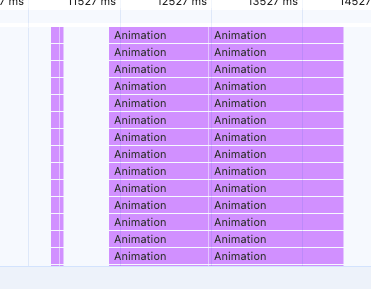
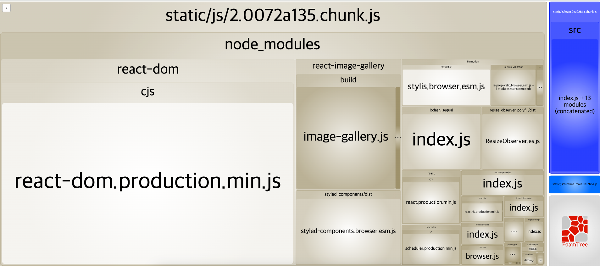
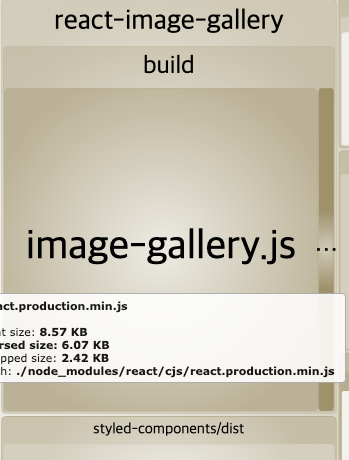
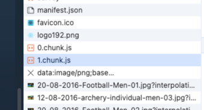
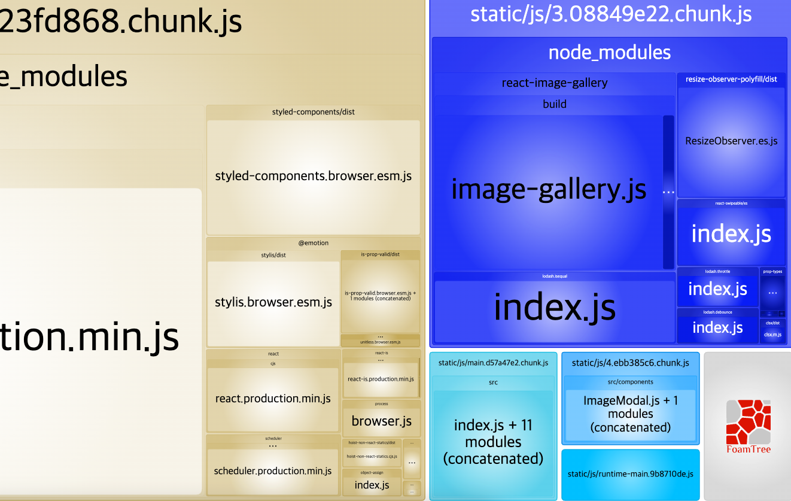
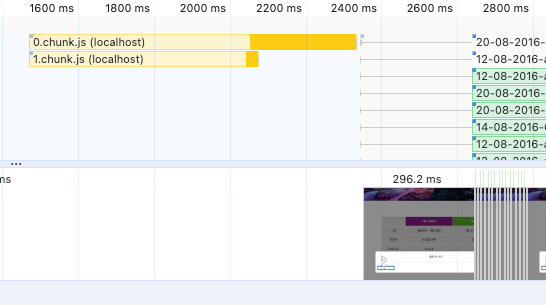
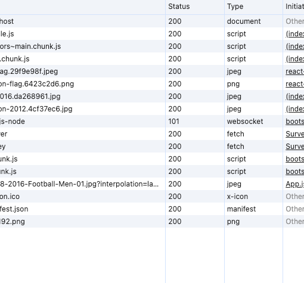

# 2장 올림픽 통계 서비스 최적화

### 학습할 최적화 기법

- CSS 애니메이션 최적화
- 컴포넌트 지연 로딩
- 컴포넌트 사전 로딩
- 이미지 사전 로딩

-----------

이 서비스는 리우 올림픽과 런던 올림픽을 비교하는 단일 페이지로 이루어져 있는 사이트이다.


### 문제점

#### 첫번째

하단에 올림픽 사진 이라는 버튼을 누르면 사진이 로드되기 전에 모달이 이상한 형태로 깨져있다가 생긴다.

네트워크에서 Fast 3G , Disabled Cache 를 사용하면 상황은 좀 더 좋지 않아진다.

이것만 볼 경우에는 사진 사이즈가 너무 커서 늦게 로드되는 것으로 추측할 수 있다.

#### 두번쨰

올림픽 사진 보기 버튼 아래에는 설문 결과 항목이 있다. 설문 겨롸는 막대 그래프로 표시되어 있고

하나의 항목을 클릭하면 해당 답변에 응답한 사람들에 대해서 필터링을 하여 그래프를 다시 보여준다.

이 때 막대 길이의 애니메이션을 보여주는데 자연스럽지 않은 모습을 보여준다.

-----------------

## Image

```typescript
{showModal ? <ImageModal closeModal={() => { setShowModal(false) }} /> : null}
```

showModal Boolean 값으로 ImageModal 을 렌더링 시키고 있다는걸 알 수 있다.

ImageModal 컴포넌트에서 중점으로 봐야할 것

- react-image-gallery 라이브러리 사용
- 라이브러리에 이미지 데이터를 넘겨 화면에 표시 중

외부 라이르러리를 사용한다는 것은 해당 라이브러리의 사이즈만큼 최정 번들링된 자바스크립트의 사이즈가 커지는 것

이미지 자체를 로드하는데 시간이 걸려 사용자에게 늦게 보일수도 있고 더 중요한 리소스를 로드하는 것을 방해할 수도 있다.

--------------------

## Bar

Bar 컴포넌트에서는 막대 그래프와 텍스트를 그리기 위한 요소들이 있다.

styled-components 를 이용해서 구현한 바 그래프와 width, transtion 속성이다.

percent 값이 바뀌면 width 값이 같이 바뀌면서 transition 속성에 의해 애니메이션이 일어난다.


------------------

## 애니메이션 최적화

설문 결과 영역에 들어간 애니메이션에 대한 최적화를 교재에서 첫 번쨰 내용으로 남겼다.

설문 항목을 클릭하면 해당 응답에 대해 필터링되고 막대 그래프의 배경 그래프의 배경 색과 막대의 가로 길이가 변한다.

하지만 이 애니메이션은 부드럽게 늘어나지 않고 살짝 끊긴다고 한다.

이런 현상이 쟁크(jank) 라고 한다. 왜 이런 현상이 일어나는가?

이 현상을 이해하려면 어떻게 화면을 그리는지 알아야 한다.


8FPS 의 애니메이션을 보여줄 떄 8장의 사진을 순서대로 보여줘야 하는데 만약 한 장의 이미지가 빠진다면 어떻게 될까?

어색하게 끊기는 부분이 있을 것이다.

### 브라우저 렌더링 과정

브라우저는 DOM + CSSOM > 렌더 트리 > 레이아웃 > 페인트 > 컴포지트 이 과정을 거쳐서 화면을 그린다.

주요 렌더링 경로 또는 픽셀 파이프라인 이라고 한다.

### DOM + CSSOM

가장 처음에는 HTML 파일과 CSS 등 화면을 그리는데 필요한 리소스를 다운로드

다운로드한 파일을 브라우저가 이해할 수 있는 형태로 변환하는 파싱 과정을 거친다. 요소간의 관계가 트리 구조로 표현되어 있는 DOM 을 만든다.

CSS 또한 비슷한 과정을 거쳐 브라우저가 이해할 수 있는 형태로 변환된다.

### 렌더 트리

렌더 트리는 DOM 과 CSSOM 의 결합으로 생성된다. 렌더 트리는 화면에 표시되는 각 요소의 레이아웃을 계산하는데 사용된다.

### 레이아웃 

렌더 트리가 완성이 되면 레이아웃 단계로 넘어간다. 이 레이아웃 단계에서는 위치와 크기를 계산하고 해당 위치에 요소를 배치하는 작업을 한다.

### 페인트

화면의 요소의 위치와 크기를 잡아 놨으니 화면에 배치된 요소에 색을 채워넣는 작업을 한다.

예를 들어 배경 색을 채워 넣거나 글자 색을 결정하거나 테두리 색을 변경한다.

### 컴포지드

컴포지드 단계는 각 레이어를 합성하는 작업을 한다.

페인트 단계에서 설명한 것처럼 브라우저는 화면을 그릴 떄 여러 개의 레이어로 화면을 쪼개서 그린다.

레이어를 하나로 합성하는 단계. 컴포지드 단계이다.

브라우저 렌더링 과정을 살펴본다. 이 과정을 브라우저에서 직접 확인해 볼 수 있다.


나같은 경우는 점선은 찾지 못했다. 다만 위에 있는 내용이 맞지 않나 싶은데?

화면이 전부 그려진 후 설문 결과에서 애니메이션처럼 일부 요소의 스타일을 변경하거나 추가 제거하면 다시한번 그리는 행동

**리페인트, 리플로우가 일어난다**

### 리플로우와 리페인트

렌더링 경로에 대입해 보면 먼저 요소의 스타일이 변했기 떄문에 CSSOM을 다시 만들어야 한다.

CSSOM 을 이용하여 새로운 렌더 트리를 만든다.

처음부터 알맞게 색을 칠하고 분할된 레이어를 하나로 컴포지드한다. 이것을 리플로우라 한다.

그냥 처음부터 끝까지 다시한다. 그로인해 브라우저 리소스를 많이 사용한다.

스타일 속성이 변경되었기 때문에 CSSOM 이 새롭게 생성되고 렌더 트리도 새로 만들어진다.

하지만 레이아웃 단계는 실행되지 않는다. 요소의 위치나 크기에는 영향이 가지 않기 떄문이다.

바로 색을 입히는 페인트, 컴포지드 단계로 이동된다. 이것을 리페인트라 한다.

이것을 피하기 위해서 transform, opacity 같은 속성을 사용하는 방법이 있다.

**해당 요소를 별도의 레이어로 분리하고 작업을 GPU에 위임하여 처리할 수 있다. 레이아웃 단계와 페인트 단계를 건너뛸 수 있다.**

이것을 **하드웨어 가속** 이라한다.

### 하드웨어 가속

하드웨어 가속은 CPU 에서 처리해야 할 작업을 GPU에 위임하여 더욱 효율적으로 처리하는 방법을 말한다.

특정 요소에 하드웨어 가속을 사용하려면 요소를 별도의 레이어를 분리하여 GPU로 보내야 하는데

앞서 말한 transform, opacity 두 옵션이 이 역할을 한다.

width, height, color 등의 속성이 아닌 transform, opacity 이용한 애니메이션 성능이 좋을 수 밖에 없다.

------

### 애니메이션 최적화

문제의 원인과 해결 방법을 알았으니 리플로우를 -> 리페인트로 바꾸면 된다.

```javascript
const BarGraph = styled.div`
    position: absolute;
    left: 0;
    top: 0;
    height: 100%;
    background: ${({isSelected}) => isSelected ? 'rgba(126, 198, 81, 0.7)' : 'rgb(198, 198, 198)'};
    z-index: 1;

    width: 100%;
    transform: scaleX(${({width}) => width / 100});
    transform-origin: center left;
    transition: transform 1.5s ease;
`
```




저의 경우에는 약 두 배 이상의 성과를 보여줬습니다.

-----------------------------------

## 컴포넌트 지연 로딩

1장에서 시도했던 컴포넌트 지연 로딩에 대한 내용이다.

우선 cra-bundle-analyzer 를 설치해서 번들 사이즈를 확인.



react-image-gallery 라는 라이브러리가 들어 있는데

이 라이브러리에 커서를 올려 두면 대략적인 사이즈가 나온다.

56KB 가 나왔다. 해당 라이브러리는 그렇게 큰 용량은 아니지만

조금이라도 효율적으로 사용하기 위해서 이 라이브러리 코드를 분할하고 지연 로딩을 적용해보자




NETWORK 패널에서 로드 이후 사진 보기 버튼을 클릭했을 때

새로운 청크 파일이 로드되는 것을 볼 수 있다.



또한 Cra-bundle-analyzer 에서도 시각적인 부분에서 변경 된 것을 알 수 있었다.



컴포넌트가 현재는 큰 용량을 지니고 있지 않지만 점점 커진다면 유의미한 변화를 볼 수 있을 것이다.

## 컴포넌트 사전 로딩

### 지연 로딩의 단점

지연 로딩 기법을 적용해서 초반 로딩의 속도는 개선되었지만

올림픽 사진을 보았을 때 의 로딩은 여전히 느리다.

로딩을 늦춤으로써

모달이 뜨기까지의 지연이 발생하고 있다.

퍼포먼스 체크를 했을 때 나오는 내용은 다음과 같다.



클릭 시점과 모달이 뜨는 시점이 크게 차이가 난다.

이 문제를 해결하기 위해서는 사전 로딩 기법을 사용하면 된다.

- ASIS: 모달 코드가 필요한 시점에 버튼을 클릭하여 로딩
- TODO: 버튼을 클릭하기 전에 미리 모달 코드를 로드해 둔다.

하지만 여기에는 문제점이 있다.

- 사용자가 버튼을 언제 클릭할 지 모른다.
- 모달 코드를 언제 로드해 둘지 모른다.

방법은 두 가지 있다.

사용자가 버튼 위에 마우스를 올려놨을 때와 페이지가 최초 마운트가 끝났을 떄이다.

### 컴포넌트 사전 로딩 타이밍

React 에서 Button, Div 요소에 onMouseEnter 이벤트를 사용하여
알 수 있으므로 이 시점에 이벤트를 걸어 로드를 시키면 된다.

네트워크 탭에서 마우스를 올려두었을떄 자동적으로 로드한 것을 알 수 있었다.

**굉~~장히 효율적인 방법이라고 생각한다.**

모달 컴포넌트가 만약 너무 커서 로드하는데 시간이 많이 필요하다고 판단되는 경우에는

useEffect 를 사용하여 마운트가 끝난 이후 사전 로딩 기법 코드를 집어 넣으면 될 것이다.

--------

## 이미지 사전 로딩

### 느린 이미지 로딩

모달에 최적화 기법을 적용해 보았는데 그 과정에서

이미지가 너무 늦게 로딩되는 것을 볼 수 있었다.

이미지가 제떄 뜨지 않아 나타나는 현상이다.

모달을 띄우고 이미지를 로드하려고 하는데

이미지의 사이즈가 너무 크다 보니 다운로드 시간이 오래 걸려 생기는 문제이다.

### 이미지 사전 로딩

컴포넌트는 import 함수를 이용하여 로딩하였는데

이미지는 이미지가 화면에 그려지는 시점에 로드된다.

하지만 이런 경우 외에도 자바스크립트로 이미지를 직접 로드하는 방법이 한 가지 있다.

자바스크립트의 Image 객체를 사용하는 방법이 있다.

```javascript
const img = new Image();
img.src = '~~~';
```

개발자 도구에서 만약 위 코드를 콘솔에서 적는다면 네트워크 패널에서
해당 이미지가 다운로드 되는 것을 볼 수 있다.

이걸 실제로 코드에 적용시켜 보았다.

```javascript
useEffect(() => {
  const component = import('./components/ImageModal');

  const img = new Image();
  img.src = '\n' +
    'https://stillmed.olympic.org/media/Photos/2016/08/20/part-1/20-08-2016-Football-Men-01.jpg?interpolation=lanczos-none&resize=*:800'
}, []);
```



페이지를 로드했을 때 미리 로드되는 것을 볼 수 있다.

다시 올림픽 사진 보기를 누른 이후에는 미리 사진이 로드가 되어있어 아예 빈 모달이 보여지는 현상은 없어졌다.

다만 여기서 몇가지 이미지까지 미리 로드를 하는가에 대한 문제점이 남아있다.

사전에 로딩을 하면 브라우저의 리소스를 많이 사용학 ㅣ떄문에

다른 성능 문제를 야기할 수 있기 떄문이다.