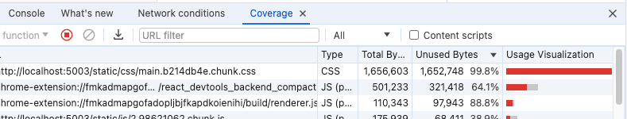

# 03. 홈페이지 최적화

롱보를 소개하는 사이트이고 총 4개의 페이지로 구성되어 있다.

이 장에서는 다음과 같은 내용이 있다.

- 이미지 지연 로딩
- 이미지 사이즈 최적화
- 폰트 최적화
- 캐시 최적화
- 불필요한 CSS 제거

--------

Github 에서 프로젝트를 다운로드하고 실행시키면

사앋네 헤더가 있고 첫 페이지에 동영상 배너와 함께 기본 폰트가 아닌 커스텀 폰트로 문구가 적혀있다.

교재에서 중요시하는 컴포넌트 BannerVideo 컴포넌트를 살펴보면 

배너 영역에 들어가는 콘텐츠이다. 눈에 띄는 점은

className 에서 TailwindCSS 를 사용하고 있어서 길~게 클래스가 늘어져 있다.

또한 TailwindCSS 때문에 CSS 코드가 따로 필요가 없다.

----------------------

## 이미지 지연 로딩

### 네트워크 분석

네트워크를 확인할 때 명확한 흐름을 파악할 수 있도록 네트워크에 throttling 을 적용한다.

보통은 Fast 3G / Slow 3G 설정을 적용했지만 기본 설정보다 조금 더 빠른 환경으로 설정하기 위해
커스텀 성정이 가능하다.

network 칸에서 스로틀에서 Add 버튼을 누르면


위와 같은 모습이 나온다.

다운로드와 업로드 속도 등등 설정 가능하다.

이후 네트워크를 체크해보면

bundle 파일이 다운로드 되고 -> main 1,2,3 이미지 다운로드 -> 폰트 다운로드가 되는것을 확인 가능하다.

### 문제점 

그런데 banner-video 는 페이지에서 가장 먼저 보여지는 화면인데 가장 느리다.
아... 이건 좀

해결법은 당장 사용되지 않는 이미지를 나중에 다운로드 되도록 하여 동영상이 먼저 다운로드되게 하는 것이다.

이미지가 화면에 보이는 순간 또는 그직전에 이미지를 로드하는 방식으로 바꿔야 한다.

### intersection Observer

이미지 지연 로딩을 위해 스크롤이 이동했을 때 해당 뷰포트에 이미지를 보이게 할지 판단해야 한다.

스크롤 이벤트에 이 로직을 넣으면 스크롤할 때마다 해당 로직이 아주 많이 실행된다.

이걸 방지하기 위해서 intersection Observer 를 사용하는 게 좋다.

브라우저에서 제공하는 API 이다. 특정 요소를 관찰하면 페이지 스크롤 시 해당 요소가 화면에 들어왔는지 아닌지 알 수 있다.

scroll 이벤트로 판단하는 것보다 훨씬 효율적이다.

MDN 에 자세하게 설명이 되어있다. 

https://developer.mozilla.org/ko/docs/Web/API/IntersectionObserver

```javascript
// 옵저버에 들어갈 설정 내용
const options = {
  root: null, // 가시 범위 확장 및 축소
  rootMargin: '0px', // root 요소의 여백
  threhold: 1.0, // 가시성 퍼센티지
}

const callback = (entries, obverser) => {
  console.log('Entries', entries);
}

const observer = new IntersectionObserver(callback, options);

observer.observe(document.querySelector('#target-element1'));
observer.observe(document.querySelector('#target-element2'));
```

위와 같은 코드를 프로젝트에서 추가할 수 있다.

```javascript
const imgRef = useRef(null);

useEffect(() => {
const options = {};
const callback = (entries, observer) => {
  console.log('Entires', entries);
}

const observer = new IntersectionObserver(callback, options);

observer.observe(imgRef.current);

return () => observer.disconnect();
}, []);


```


각각의 Card 컴포넌트에서 entires 값이 배열 형태로 보여주고 있다.

이 중에서 isIntersecting 이라는 값이 중요하다.

해당 요소가 뷰포트 내에 들어왔는지 나타내는 값이다.

다음으로는 화면에 이미지가 보이는 순간 이미지를 로드시키면 된다.

교재 내의 코드 상에서는  였지만

```javascript
import React, {useEffect, useRef} from 'react'

function Card(props) {

  const imgRef = useRef(null);

  useEffect(() => {
    const options = {};
    const callback = (entries, observer) => {
      entries.forEach(entry => {
        if (entry.isIntersecting) {
          console.log('is intersecting', entry.target);
          entry.target.src = props.image;
          observer.unobserve(entry.target);
        }
      });
    }

    const observer = new IntersectionObserver(callback, options);

    observer.observe(imgRef.current);

    return () => observer.disconnect();
  }, []);

  return (
    <div className="Card text-center">
      
      <div className="p-5 font-semibold text-gray-700 text-xl md:text-lg lg:text-xl keep-all">
        {props.children}
      </div>
    </div>
  )
}

export default Card
```

나는 중간에 ref={imageRef} 만 남기고 src 는 삭제시켰다.

----------------

## 이미지 사이즈 최적화

### 느린 이미지 로딩 분석

지연 로딩을 통해 배너의 동영상 콘텐츠가 별다른 지연 없이 바로 다운로드 될 수 있도록 했다.

하지만. 아직 이미지를 그리는 작업은 굉장히 느리다.

지연 로딩을 적용하기 전에는 처음부터 이미지를 불러왔기 때문에 스크롤을 내려도 굉장히 잘 보이는 것처럼 보인다.

Network 패널에서 이미지들을 살펴보면 이미자가 굉장히 큰 용량을 차지하는 것을 알 수 있다.


### 이미지 포맷 종류

간단하게 이미지 사이즈 최적화는 그냥 이미지 사이즈를 줄여서 빠르게 다운로드 시키자 이런 기법이다.

이미지 사이즈를 줄이기 전에 이미지를 잘 다루기 위해 짚고 넘어가야 할 것이 있다.

**이미지 포맷이다.** 

대표적인 세 가지 포맷이 있다.

- JPG
- PNG
- WebP

PNG는 무손실 압축 방식으로 원본을 훼손 없이 압축하며 알파 채널을 지원하는 이미지 포맷이다.

알파 채널이란 투명도를 의미한다. 

PNG 포맷으로 배경 색을 투명하게 하여 뒤에 있는 요소가 보이는 이미지를 만들 수 있다.

JPG 는 PNG 와는 다르게 압축 과정에서 정보 손실이 발생한다.
하지만 그만큼 이미지를 더 작은 사이즈로 줄일 수 있다.

일반적으로 웹에서 이미지를 사용할 때는 고화질이어야 하거나 투명도가 필요한게 아니라면
JPG 를 사용한다.

WebP 는 무손실 압축과 손실 압축을 모두 제공하는 최신 이미지 포맷으로 기존의 PNG 나 JPG 에 비해서

효율적으로 이미지를 압축할 수 있다. 하지만 브라우저 호환성 때문에 사용할 때는 고려해봐야 한다.

- 사이즈: PNG > JPG > WebP
- 화질: PNG = WebP > JPG
- 호환성: PNG = JPG > WebP

### Squoosh 를 사용하여 이미지 변한

JPG, PNG 포맷의 이미지를 WebP 포맷으로 변환하여 고화질, 저용량의 이미지로 최적화 해볼수 있다.

교재에서 사용법을 가르쳐주지만 매우 간단한 내용이므로 생략...


하지만 문제가 있다고 한다. 이미지 포맷을 비교할 때 호환성 문제가 아직 남아있다.

특정 브라우저에서는 제대로 렌더링 되지 않을 때도 있다.

이럴 때 picture 태그를 사용해서 다양한 타입의 이미지를 렌더링하는 컨테이너로 사용해야 한다.

### NEXT.JS 에서는 이걸 어떻게 활용하나.

NEXT.JS 에서는 자동으로 WebP, JPG, PNG 를 구별해준다고 한다..

-------------

이어서 JPG 로 보여줘야할 브라우저도 존재하기 때문에 JPG 로 리사이즈를 다시 한번 진행하고

```javascript
<picture>
  <source data-srcset={'webp'} type={'image/webp'}/>
  
</picture>
```

형식으로 바꿔준다.

### 최적화 전후 비교

처음에 설정한 네트워크 설정인 6000kb/s 설정에서 진행했을 때 약 30초 걸리던 이미지 로딩이
0.1 초 정도로 단축되었다.

----------------------------

## 동영상 최적화

### 동영상 콘텐츠 분석

Network 패널 기록에서 보면 동영상 파일은 이미지 파일처럼 하나의 요청으로 모든 영상을 다운로드 하지 않는다.

동영상 컨텐츠 특성상 순차적으로 불러온다.

하지만 여러 번 나누어서 다운로드를 해도 애초에 동영상 파일이 크다 보니
재생까지의 시간이 오래 걸린다.


### 동영상 압축

동영상 최적화는 이미지 최적화와 비슷하다. 그냥 용량줄이기..

좀 더 들어가면 프레임 수 줄이기. 등등 여러 방법이 있지만

일단 동영상을 압축하는 툴만 사용해보자.

Media.io 라는 서비스를 이용할 수 있다.

근데... 리뉴얼되면서 하기가 힘들어져서 다른 방법으로 해야했다.

https://videopresso.co.kr/

다른 사이트에서 적용하였습니다.

용량이 줄면서 보이는 화면이 꺠져보이다 보니 보이는 부분에서는 자연스럽지 않다.

만약 영상을 자연스럽게 보여줄 필요가 없다면 blur 처리를 하여 보여주면 동영상 화질이 떨어져도 어느정도 자연스럽게 보여진다.

-----------

### 폰트 최적화

홈페이지에 쓰인 폰트를 최적화 할 수 있다.

NETWORK 패널에서 폰트를 부르기 전 특정 폰트를 적용한 코드가 적용이 되어 있지 않아

기본 폰트로 노출하고 있는 문제가 있다.


------------------------------

### FOUT, FOIT

폰트의 변화로 발생하는 이 현상을 FOUT (Flash of Unstyled Text) 또는 FOIT (Flash of Invisible Text) 라고 한다.

먼저 FOUT 는 엣지 브라우저에서 폰트를 로드하는 방식으로 폰트의 다운로드 여부와 상관없이 먼저 텍스트를 보여준 후

폰트가 다운로드되면 그 때 폰트를 적용하는 방식이다.

사파리, 파이어폭스 등에서는 폰트가 완전히 다운로드 되기 전까지는 텍스트를 보여주지 않지만

크롬에서는 제대로 다운로드가 되지 않아도 일단 텍스트가 보인다.

완전한 FOIT 가 아니라 3초만 기다리는 FOIT 이기 떄문이다. 3초 동안은 폰트가 다운로드 되기를 기다리다가 3초가 지나도 폰트가 다운로드 되지 않으면

기본 폰트로 텍스트를 보여준다.

### 폰트 최적화 방법

폰트를 최적화하는 방법은 크게 두 가지가 있다.

- 폰트 적용 시점을 제어하는 방법
- 폰트 사이즈를 줄이는 방법

#### 폰트 적용 시점 제어하기

FOUT 가 좋을 떄도 있고, FOIT 가 좋을 떄가 있다.

중요한 테그트를 빨리 보여줘하는 경우 FOIT 방식으로 폰트를 적용하면
텍스트 내용이 사용자에게 빠르게 전달되지 않을 것이다.

사용자에게 즉시 보여주지 않아도 되는 텍스트의 경우 FOUT 방식으로 폰트 변화를 주는게
좋은 방법일 수 있다.

CSS font-display 속성을 이용하면 폰트가 적용되는 시점을 제어 가능하다.

font-display 는 @font-face 에서 설정할 수 있다.

default 설정은 이렇다.

- auto: 브라우저 기본 동작 값
- block: FOIT
- swap: FOUT
- fallback: FOIT / 3초 후에도 불러오지 못한 경우 기본 폰트 유지 및 이후 캐시
- optional: FOIT 이후 네트워크 상태에 따라 기본 폰트로 유지할기 결정 이후 캐시

이 속성을 이용하면 FOUT 방식으로 폰트를 렌더링 하는 Edge 에 FOIT 방식을 적용하거나

FOIT 방식으로 폰트를 렌더링하는 크롬에 FOUT 방식을 적용할 수 있다.

font-display 속성을 이용해서 폰트가 적용하는 시점을 제어할 수 있다.

중요한 것은 서비스 하는 콘텐츠의 특성에 맞게 적절한 값을 설정하는 것이다.

이 서비스에서는 FOIT 방식인 block 을 설정하는게 좋아보인다.

중요한 텍스트 내용이 아니기도 하고 폰트가 유지된 상태에서 보여주는 것이 좀 더 자연스럽기 떄문이다.

문제는 이렇게 block 옵션을 설정하면 안보이던 폰트가 갑자기 나타나서 어색하다.

이 문제를 해결하기 위해서 페이드 인 애니메이션을 적용하는게 좋아 보인다.

폰트에 페이드 인 효과를 적용하려면 CSS 가 아닌 자바스크립트의 기능이 필요하다.

```
npm install --save fontdaceobserver
```

다운로드한 fontfaceobserver 는 import를 한 후 new 연산자를 사용하여 인스턴스를 생성할 수 있다. load 메섣를 통해 어느 시점에 폰트가 다운로드되었는지
알 수 있다.

이때 load 메서드는 테스트 문자열과 타임아웃 값을 설정 Promise 객체를 반환한다.

```javascript
import React, {useEffect, useState} from 'react'
import video from '../assets/banner-video.mp4'
import FontFaceObserver from 'fontfaceobserver';

const font = new FontFaceObserver('BMYEONSUNG');

function BannerVideo() {

  const [isFontLoaded, setIsFontLoaded] = useState(false);

  useEffect(() => {
    font.load(null, 2000).then(() => {
      console.log('font Load');
      setIsFontLoaded(true);
    })
  }, []);

  return (
    <div className="BannerVideo w-full h-screen overflow-hidden relative bg-texture">
      <div className="w-full h-full flex justify-center items-center"
           style={{opacity: isFontLoaded ? 1 : 0, transition: 'opacity 0.3s ease'}}
      >
        <div className="text-white text-center">
          <div className="text-6xl leading-none font-semibold">KEEP</div>
          <div className="text-6xl leading-none font-semibold">CALM</div>
          <div className="text-3xl leading-loose">AND</div>
          <div className="text-6xl leading-none font-semibold">RIDE</div>
          <div className="text-5xl leading-tight font-semibold">LONGBOARD</div>
        </div>
      </div>
    </div>
  )
}

export default BannerVideo

```

이렇게 투명도를 폰트 로드 상테에 따라 바꿔주는 애니메이션을 넣어서 훨씬 자연스러워졌다.

### 폰트 파일 크기 줄이기

이번에는 폰트 파일 크기를 줄여 폰트가 다운로드 되는 시간을 단축하는 방법을 알아보자.

폰트 파일 크기를 줄이는 방법에는 두 가지가 있다.

하나는 이미지나 비디오와 마찬가지로 압축률이 좋은 폰트 포맷을 사용한느 것.

달느 하나는 필요한 문자의 폰트만 로드하는 것이다.

### 폰트 포맷 변경하기

흔히 알고 있는 폰트 포맷은 운영 채제에서 사용하는 TTF 및 OTF 포맷이다.

현재 홈페이지에 적용되어 있는 폰트도 TTF 포맷이다.

TTF 포맷은 파일 크기가 매우 큳. 이미 다운로드 되어 있는 운영 체제 환경에서는 상관없지만

매번 리소스를 다운로드 하는 웹에서는 적절하지 않다.

그걸 개선하기 위해 나온 것이 **WOFF(Web Open Font Format)** 이다.

더 나아가서 WOFF2 라는 더욱 향상된 압축 방식을 적용한 포맷도 존재한다.

#### 하지만

이미지 포맷과 마찬가지로 브라우저 호환성 문제가 있다. 모던 브라우저에서는 정상적으로 사용이 가능하지만

버전이 낮은 일부 브라우저에서는 해당 포맷을 지원하지 않을 수 있다.


TransFonter 라는 웹 서비스가 있다 . https://transfonter.org/

현재 사용중인 폰트파일을 업로드하고 변환하여 다운로드를 하면 된다.


주의점은 Woff2 를 맨앞에 둬야한다. ttf 를 맨앞에 둘 경우 ttf 먼저 다운로드를 시도한다.

한 발 더 나아가서 폰트를 파일 형태가 아닌 Data-URI 형태로 CSS 파일에 포함할 수 있다.

**Data-URI**란 data 스킵이 접두어로 붙은 문자열 형태인ㄴ데

파일을 문자열 형태로 변환하여 문서에 인라인으로 삽입하는 것이다.

우선 폰트 파일을 Data-URI 형태로 App.css 에 포함하려면 폰트를 문자열 데이터로 변환해야 한다.

이 역시 방금 웹 서비스에서 사용할 수 있다.

저장시에 Base64 on off 에서 On 을 설정해 주고


다운로드의 결과물에서 나온 stylecss 에서 나오는 dataURI 를 복사하여 붙여줬다.


FAST 3g 환경에서도 굉장히 빠른 속도로 나오게 되었다.

## 캐시 최적화

## 캐시란

캐시는 간단히 말하면 자주 사용하는 데이터나 값을 미리 복사해 둔 임시 저장 공간 혹은 저장하는 공간이다.

웹에서는 서비스에서 사용하는 이미지나 자바스크립트 파일을 매번 네트워크를 통해 불러오지 않고

최초에만 다운로드하여 캐시에 저장하여 저장해 둔 파일을 불러온다.

웹에서 사용하는 캐시는 크게 두 가지로 구분된다.

- 메모리 캐시: 메모리에 저장하는 방식이다. 여기서는 메모리는 RAM 을 의미한다.
- 디스크 캐시: 파일 형태로 디스크에 저장하는 방식이다.

어떤 캐시를 사용할지는 직접 제어할 수 없다, 브라우저가 사용 빈도나 파일 크기에 따라 특정 알고리즘에 의해 알아서 처리한다.

Network 패널에서 Size 항목에 memory cache 또는 disk cache 라고 표시된 것을 볼 수있다.


구글에서 단순 새로고침을 한 후 확인했다면 memory cache 가 많을 것이다.

구글의 리소스가 메모리에 캐시되었기 때문이다. 브라우저를 완전히 종류후 구글에 접속하는 첫 네트워크를 확인하면

disk Cache 가 많을 것이다.

**브라우저가 완전히 종료되면 메모리에 있는 내용은 제거하고 다음 접속 때는 파일 형태로 남아 있는 캐시를 활용하기 때문이다.**

브라우저가 캐시를 하기 위해서는 Cache-control 이라는 헤더가 응답 헤더에 있어야 함을 알았다.
Cache-control은 어떤값으로 설정되어있는가?

### Cache-control 

리소스의 응답 헤더에 설정되는 헤더이다. 브라우저는 서버에서 이 헤더를 통해 캐시를 어떻게, 얼마나 적용해야 하는지 판단한다.

Cache-Control 에는 대표적으로 아래 5가지 값이 조합되어 들어간다.

- no-cache: 캐시를 사용하기 전 서버에 검사후 사용
- no-store: 캐시 사용을 안함
- public: 모든 환경에서 캐시 사용 가능
- private: 브라우저 환경에서만 캐시 사용, 외부 캐시 서버 사용 불가
- max-age: 유효 시간

캐시를 사용하지 않는 옵션은 no-store 이다. public 과 private 으로 설정하면 max-age 에 설정한 시간만큼은 서버에 사용 가능 여부를 묻지 않고
캐시된 리소스에 바로 사용한다.

만약 유효 시간이 지났다면 서버에 캐시된 리소스를 사용해도 되는지 다시 체크 후

유효 시간만큼 더 사용한다.

public 과 private 의 차이는 캐시 환경에 있다. 웹 리소스는 브라우저 뿐만 아니라
웹 서버 / 브라우저 사이를 연결하는 중간 캐시 서버에서도 캐시될 수 있다.

중간 서버에서 캐시를 하는것을 원치 않다면 private 옵션을 사용한다.

### 캐시 적용

캐시는 응답 헤더에서 Cache-control 헤더를 통해 설정된다고 하였다.

여기서 중요한 것은 응답 헤더는 서버에서 설정해 준다는 것이다.

리액트는 서버가 아니므로 캐시 설정을 할 수있도록 간단한 노드 서버를 미리 프로젝트 내에 구성이 되어 있었다.

```javascript
const header = {
    setHeaders: (res, path) => {
        res.sendFile('Cache-Control', 'max-age=10')
    },
}
```

서버의 헤더 캐시 컨트롤을 수정한 후 종료 후 다시 실행했을 떄

실행된 서비스에서 새로고침을 몇 번 해보면 Network 패널에서 리소스가 캐시되는걸 볼 수 있었다.


설정한 시간 10초 가 지난후 다시 새로고침을 하면 다른 모습으로 기록되는 것을 볼 수 있다.


304번 상태 코드로 응답을 보여주면서 캐시 시간이 지났기 떄문에 새로운 데이터를 불러오고이싿.

----------------------------------

### 적절한 캐시 유효 시간

Cache-Control 을 이용하여 캐시 설정을 적용하였는데

앞서 적용한 방식은 모든 리소스에 동일한 캐시 설정이 적용되기 떄문에 효율적이지 않다.

리소스마다 사용이나 변경 빈도가 달라 캐시의 유효 시간도 달라져야 하기때문이다.

일반적으로 HTML 파일은 no-cache 설정을 한다. 최신 버전의 웹 서비스를 제공하기 위해서.

하지만 자바스크립트와 CSS는 다르다. 빌드된 자바스크립트와 CSS는 파일명에 해시를 함께 가지고 있다.

즉 코드가 변경되면 해시도 변경되어 완전히 다른 파일이 되어 버린다.

그래서 아무리 오래 적용해도 HTML 만 최신 버전이면 자바스크립트나 CSS 파일 상태는 최신 리소스를 로드하게 딘다.

```javascript
const header = {
  setHeaders: (res, path) => {
    if (path.endsWith('.html')) {
      res.setHeader('Cache-Control', 'no-cahce')
    } else if (path.endsWith('.js') || path.endsWith('.css') || path.endsWith('.webp')) {
      res.setHeader('Cache-Control', 'public, max-age=31536000')
    } else {
      res.setHeader('Cache-Control', 'no-store')
    }
  },
}
```

HTML: no-cache

자바스크립트,CSS,WebP: 캐시 적용

그 외 파일들은 no-store -> 캐시 미적용

서버 재시작 


----------------

## 불필요한 CSS 제거

마지막으로 불필요한 CSS를 제거해서 최적화 해야한다.

우선 실행된 서비스 Lighthouse 로 검사해 보았을 떄 Reduce unused CSS 라는 부분이 보인다.


사용하지 않는 CSS 를 제거하면 성능에 긍정적인 영향을 줄 수 있다는 것이다

**Console -> more tools -> Coverage** 에서 기록을 다시 해보면 이런 내용이 나온다.


오른쪽 Unused Bytes 와 Usage Visualization 항목에서 전체 코드 대비 실행된 코드의 양을 비율로 보여준다.

사진에서는 필요없는 코드가 많다고 보여진다.

자바스크립트 코드 2.chunk.js 파일은 약 39퍼센트 정도 사용하고 있지 않다고 나온다.

하지만 페이지 이동을 하고 기타 동작들을 해보면 Coverage 패널의 기록이 실시간으로 변한다.

하지만 CSS의 경우에는 그렇지 않다. 별다른 분기 없이 99퍼를 사용하고 있지 않고 있다.

**TailwindCSS** 를 사용중이라 CSS 를 Import 하는 과정에서 문제가 발생한 것처럼 보인다.

### PurgeCSS

사용하고 있지 않는 CSS 코드를 제거하는 방법은 여러 가지가 있겠지만 PurgeCSS 라는 툴을 사용해서 해결할 수 있었다.

PurgeCSS 는 파일에 들어 있는 모든 키워드를 추출하여 해당 키워드를 이름으로 갖는 CSS 클래스만 보존하고 나머지 매칭되지 않은 클래스는 모두 지우는 방식으로
CSS 파일을 최적화 한다.

```
yarn add purgecss
```
---------------------------------
### 문제 발생

node version 이 맞지 않다고 나왔다..

저는 4.1.3 버전을 사용해서 재설치하였습니다

---------------------------------

```
purgecss --css ./build/static/css/*.css --output ./build/static/css/ --content ./build/index.html ./build/static/js/*.js
```

불필요한 클래스를 제거할 CSS(--css) 로 빌드된 파일을 선택하고.

아웃풋으로 (--output) 동일한 위치를 지정함으로써 새로운 파일을 생성 하지 않고 덮어 씌우는 방식으로 변경

키워드를 추출할 파일 (--content) 로는 빌드된 HTML 과 자바스크립트 파일 전부를 넣어준다.

빌드된 HTML , 자바스크립트 파일의 텍스트 키워드를 모두 추출하여 빌드된 CSS 파일의 클래스와 비교하고 최적화 하게 된다.

이상하게 새로 실행된 파일에서도 변화는 없었지만



CSS 파일을 직접 들어가보면 굉장히 많은 CSS 가 사라져 있는것을 확인 가능했다.

그리고 화면에서 일부 스타일이 제대로 적용되지 않은 것처럼 보이기도 하였다.


클래스의 스타일을 제거할 때 ":" 라는 문자열을 인식하지 못하고 잘라 버렸기 때문이다.

이 문제는 PurgeCSS의 defaultExtractor 옵션을 통해 해결 가능하다.

PurgeCSS 가 키워드를 어떤 기준으로 추출할 지 정의하는 옵션이다.

```js
module.exports = {
    defaultExtractor: (content) => content.match(/[\w\:\-]+/g) || []
}
```

defaultExtractor 옵션은 인자로 대상 파일의 전체 코드를 넘겨받고 문자열 배열을 반환하여

match 메서드를 통해 정규식에 만족하는 키워드를 배열 형태로 추출한다.