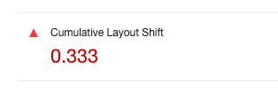
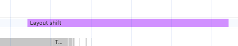
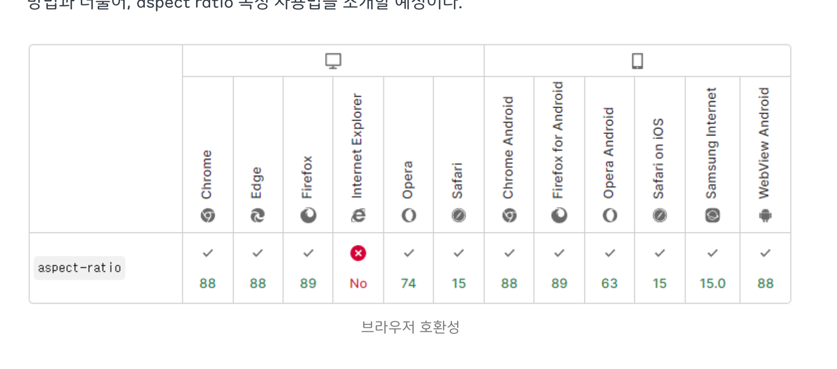
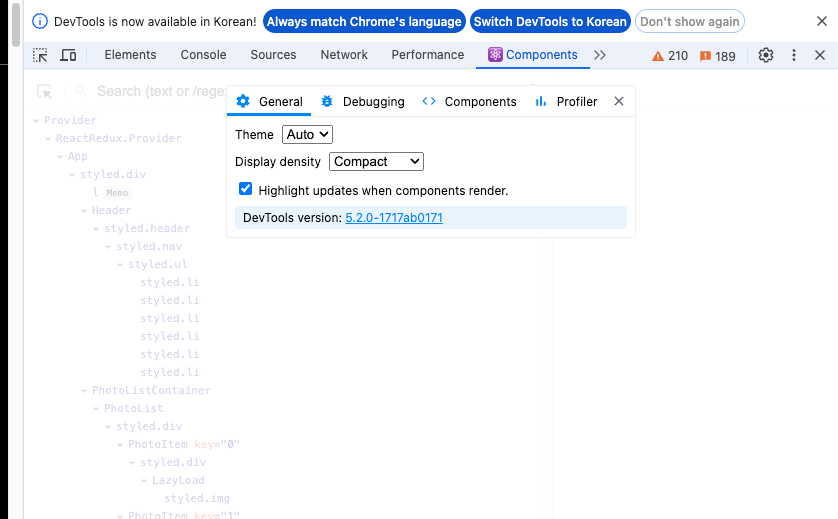
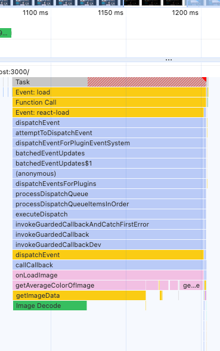

# 04장 이미지 갤러리 최적화

## 이 장에서 학습할 최적화 기법

- 이미지 지연 로디
- 레이아웃 이동 피하기
- 리덕스 렌더링 최적화
- 병목 코드 최적화

## 레이아웃 이동 피하기

이 장에서는 첫 번째 실습으로 레이아웃 이동을 피하는 방법을 알아본다.

먼저 레이아웃 이동이란 화면상의 요소 변화로 레아이앗이 갑자기 밀리는 현상을 말한다.

갤러리 서비스를 새로고침 해보면 레이아웃 이동 현상을 볼 수 있다.

이미지가 늦게 로딩될 때 아래 이미지를 밀어내면서 화면을 그린다.

이런 레이아웃 이동은 사용자의 주의를 산만하게 만들고 위치를 순간적으로 변경시키면서 의도와 다른 클릭을 유발할 수 있다.

CLS 항목을 보면 점수가 낮은건 볼 수 있다.



CLS 는 0부터 1까지 값을 가지며 레이아웃 이동이 전혀 발생하지 않은 상태가 0 그 반대를 1

권장하는 점수는 0.1 이다. 저의 경우에는 0.3... 안좋습니다.

Performance 패널에서 Experience 섹션에 Layout Shift 라는 빨간 막대가 있다고 한다. 



Experience 는 보이진 않았다.

이 막대에 커서를 올려놓으면 서비스 화면에서 레이아웃 이동을 유발한 요소를 표시해준다.


## 레이아웃 이동의 원인

- 사이즈가 미리 정의되지 않은 이미지 요소
- 사이즈가 미리 정의되지 않은 광고 요소
- 동적으로 삽입된 콘텐츠
- 웹 폰트

이 서비스에서는 사이즈가 미리 정의되지 않은 이미지 요소로 인해서 발생하였다.

이미지 사이즈를 다운로드 하면서 사이즈가 어떤지 알 수 없으니 해당 영역을 확보할 수 없다.

### 레이아웃 이동 해결

레이아웃 이동을 발생시키는 요소의 사이즈를 미리 지정해두면 된다.

이미지 크기를 비율로 설정하는 방법은 크게 두 가지 방법이 있다. 

padding 을 이용하여 박스를 만든 뒤 그 안에 이미지를 absolute 띄우는 방식이다.

```css
.wrapper {
  position: absolute;
  width: 100px;
  padding-top: 56.25%; /* 16:9 비율 */
}

.image {
  position: absolute;
  width: 100%;
  height: 100%;
  top: 0;
  left: 0;
}
```

다른방법이 있다면 padding 퍼센트를 매번 계산해야 하고 코드가 직관적이다.


aspect-ratio 라는 CSS 속성을 사용하면 된다.

```css
.wrapper {
  width: 100%;
  aspect-ratio: 16 / 9;
}

.image {
  width: 100%;
  height: 100%;
}
```

padding을 이용한 방법과 달리 코드가 간단하다. 하지만.. 항상 그렇듯이 호환성 문제가 있다.



라는데 인터넷 익스플로어 죽은 김에 그냥 쓰면 되지 않을까?

```javascript
const ImageWrap = styled.div`
  width: 100%;
  padding-bottom: 56.25%;
  position: relative;
`;

const Image = styled.img`
  cursor: pointer;
  width: 100%;
  position: absolute;
  height: 100%;
  top: 0%;
  left: 0%;
`;
```

styled-components 를 변경하여 적용시켰다.

## 이미지 지연 로딩

이미지 지연 로딩 기법을 사용할 것인데 이번엔 다른 라이브러리를 적용시켰다.

```
yarn add react-lazyload
```

```javascript
<ImageWrap>
  <LazyLoad>
    <Image src={urls.small + '&t=' + new Date().getTime()} alt={alt} onClick={openModal} />
  </LazyLoad>
</ImageWrap>
```

이런식으로 씌워주기만 하면 내 시점에 보이는 시점에 로딩을 해준다고 한다.

조금 아쉬운 점이 있다면 첫 로딩떄 이미지가 보이지 않고 시간이 지나야 이미지가 보인다는 점이다/

이 문제를 해결하기 위해서는 화면에 들어오는 시점보다 살짝 더 빨리 이미지를 불러서 화면에 그려주는게 좋다.

이걸 offset 이라는 옵션을 통해서 어느정도 조정 가능하다.

```javascript
<LazyLoad offset={150}>
  <Image src={urls.small + '&t=' + new Date().getTime()} alt={alt} onClick={openModal} />
</LazyLoad>
```

## 리덕스 렌더링 최적화

리엑트는 렌더링 사이클을 갖는다. 서비스의 상태가 변경되면 화면에 반영하기 위해 리렌더링 과정을 거친다.

렌더링하지 않아도 되는 화면에서 불필요하게 리렌더링을 하다보니 스레드의 리소스를 차지하게 된다.

여기서는 React-Developer-Tools 을 사용할 것이다.



Component 패널의 설정 버튼을 클릭해서 다양한 설정을 할 수 있다.

HighLight updates when components render 버튼을 클릭해서 렌더링 시에 나오는 테두리를 확인 가능하다.

- 헤더나 이미지를 클릭했을 떄
- 모달을 띄우는 순간
- 모달의 이미지가 로드된 후 배경 색이 바뀌는 순간
- 모달을 닫는 순간

리렌더링이 발생한다.

### useSelector 문제

이 문제를 해결하는 방법은 여러 가지 있는데 객체를 새로 만들지 않도록 반환 값을 나누는 방법과 Equality Function 을 사용하는 방법

```javascript
const { modalVisible, bgColor, src, alt } = useSelector(state => ({
  modalVisible: state.imageModal.modalVisible,
  bgColor: state.imageModal.bgColor,
  src: state.imageModal.src,
  alt: state.imageModal.alt,
}));
```

이렇게 된 것을 단일 값으로 바꿔줘야 한다.

```javascript
const modalVisible = useSelector(state => state.imageModal);
const bgColor = useSelector(state => state.bgColor);
const src = useSelector(state => state.src);
const alt = useSelector(state => state.alt);
```

### 새로운 Equality Function 사용

Equality Function 이란 useSelector 에 넣는 함수로 리덕수 함수가 변경되었을 때 반환해야 하는 값에도 영향을 미쳤는지 판단하는함수이다.

```javascript
  const { photos, loading } = useSelector(state => ({
  photos:
    state.category.category === 'all'
      ? state.photos.data
      : state.photos.data.filter(
        photo => photo.category === state.category.category
      ),
  loading: state.photos.loading,
}), shallowEqual);
```

확실히 전자보다는 이게 더 효율적이라고 판단된다.

수정 후에 이미지 모달을 띄우면 불필요한 리렌더링이 없어 굉장히 효율적이다.

useSelector 의 원리를 보면 된다고 하는데 filter 메서드 때문이라고 한다.

필터링된 이미지 리스트를 가져오는데 이때 가져온 이미지 리스트 배열은 새롭게 만들어진 배열이기 때문에 이전에 만들어진 배열과 참조 값이 달라진다.

새로운 배열을 꺼내는 대신 sate, photos, data 와 state,category,category 를 따로 꺼낸 후 밖에서 필터링 해야한다.

```javascript
const { category, allPhotos, loading } = useSelector(state => ({
    category: state.category.category,
    allPhotos: state.photos.data,
    loading: state.photos.loading,
  }), shallowEqual);

  const photos = category === 'all' ? allPhotos : allPhotos.filter(photo => photo.category === category);
```

## 병목 코드 최적화

병목 코드를 찾기 위해 퍼포먼스 패널을 이용.

이 서비스에서는 크게 3가지 지점을 확인해 볼 수 있다.

- 페이지 최초로드
- 카테고리 변경
- 이미지 모달 UP

이미지가 늦게 나오는건 어쩔 수 없지만 배경 색이 늦게 나오는건 원인을 살펴봐야 한다.



퍼포먼스 체크를 하니 200ms 정도 소요되었는데.

getAverageColorOfImage 함수가 눈에 띈다. 이미지에 관한 처리 작업을 있음을 알 수 있다.

### getAverageColorOfImage 함수 분석

명확하게 이 함수가 느리다는 것을 알 수 있다. 평균 픽셀 값을 계산하는 함수인데

반복문을 통해서 캔버스를 하나하나 읽는 점이 이 코드를 느리게 만들었다.

### 메모이제이션으로 코드 최적화 하기

메모제이션이란 한 번 실행된 함수에 대해 반환 값을 기억해 두고 있다가 똑같은 조건이 들어온다면 코드를 실행하지 않고 반환값을 내놓는 기술이다.

```javascript
if (cache.hasOwnProperty(imgElement.src)) {
  return cache[imgElement.src];
}
cache[imgElement.src] = averageColor;
```

코드를 적용하고 나서 다시 모달을 띄워 보면 초반은 느리지만 그 이후에는 빠르게 적용되는 것을 볼 수 있다.

### 함수 로직 개선

여전히 첫 로딩은 느리기 떄문에 개선해야한다.

이 반복문들은 기본적으로 픽셀을 전부 읽고 있기 떄문에 그냥 이미지 용량을 줄이면 된다..

그리고 이미지의 썸네일 사진을 저장하고 그 이미지를 기준으로 함수를 사용하게 하면 된다.

리덕스로 백그라운드의 컬러를 저장까지하면 완벽
