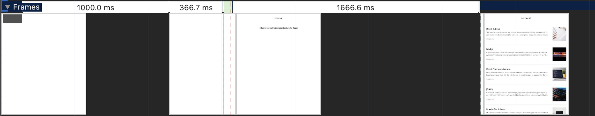

# 웹 성능을 결정하는 요소

웹 성능을 결정하는 요소는 크게 로딩성능과 렌더링 성능으로 나눌 수 있다.

**로딩성능**
>서버에 있는 웹 페이지와 웹 페이지에 필요한 기타 리소스를 다운로드할 때의 성능

**렌더링 성능**
>다운로드한 리소스를 가지고 화면을 그릴 때의 성능

# DevTools

#### 크롬 개발자 도구
- Network 패널
- Performance 패널
- Lighthouse 패널
#### [webpack-bundle-analyzer](https://www.npmjs.com/package/webpack-bundle-analyzer)
- webpack 번들 파일을 treemap 으로 시각화해 보여준다.
#### [cra-bundle-analyzer](https://www.npmjs.com/package/cra-bundle-analyzer)
- CRA 환경에서 eject 하지 않고 webpack-bundle-analyzer를 사용할 수 있게 해준다.

# Lighthouse 툴을 이용한 페이지 검사

Lighthouse의 Mode와 Categories 항목 값 소개
#### Mode
- Navigation : 기본값으로, 초기 페이지 로딩 시 발생하는 성능 문제를 분석
- Timespan : 사용자가 정의한 시간 동안 발생한 성능 문제를 분석
- Snapshot : 현재 상태의 성능 문제를 분석

#### Categories
- Performance : 웹 페이지의 로딩 과정에서 발생하는 성능 문제를 분석
- Accessibility : 서비스의 사용자 접근성 문제를 분석
- Best practices : 웹사이트의 보안 측면과 웹 개발의 최신 표준에 중접을 두고 분석
- SEO : 검색 엔진에서 얼마나 잘 크롤링되고 검색 결과에 표시되는지 분석
- Progressive Web App : 서비스 워커와 오프라인 동작 등, PWA와 관련된 문제를 분석

# Lighthouse 검사 결과 분석하기


#### 종합 점수
- 아래 여섯 가지 지표 (metrics)에 가중체를 적용해 평균 낸 점수이다.
#### FCP : First Contentful Paint
- 페이지가 로드될 때 브라우저가 DOM 콘텐츠의 첫 번째 부분을 렌더링하는 데 걸리는 시간에 관한 지표이다.
#### SI : Spped Index
- 페이지 로드 중에 콘텐츠가 시각적으로 표시되는 속도를 나타내는 지표이다.
#### LCP : Largest Contentful Paint
- 페이지가 로드될 때 화면 내에 있는 가장 큰 이미지나 텍스트 요소가 렌더링되기까지 걸리는 시간을 나타내는 지표이다.
#### TTI : Time to Interactive(TTI)
- 사용자가 페이지와 상호 작용이 가능한 시점까지 걸리는 시간을 측정한 지표이다.
#### TBT : Total Blocking Time
- 페이지가 클릭, 키보드 입력 등의 사용자 입력에 응답하지 않도록 차단된 시간을 총합한 지표이다.
- 측정은 FCP 와 TTI 사이의 시간 동안 일어나며 메인 스레드를 독점하여 다른 동작을 방해하는 작업에 걸린 시간을 총합한다.
#### CLS : Cumulative Layout Shift
- 페이지 로드 과정에서 발생하는 예기치 못한 레이아웃 이동을 측정한 지표이다.
- 레이아웃 이동이란 화면상에서 요소의 위치나 크기가 순간적으로 변하는 것을 말한다.

# 이미지 최적화

#### Lighthouse 결과의 `Propertly size images`
- 적절한 사이즈로 이미지를 사용하도록 제안한다.


위 이미지를 Element 패널에서 확인해보면 실제 사이즈는 1200x1200px 이고
실제 그려지는 이미지 사이즈는 120x120px이다.

#### 120x120px 사이즈로 맞추면될까?
- 책에서는 레티나 디스플레이같은 공간(픽셀)에 더 많은 픽셀을 그릴 수 있기 때문에 **너비 기준으로 두 배** 정도 큰 이미지를 사용하는 것을 권장한다.

#### 사이즈는 어떻게 줄일까?
- 먼저 Network 패널을 통해 이미지 출처를 확인해야한다.
- 전달된 형태를 보기위해 Preview 탭으로 확인해보면 이미지 출처를 확인할 수 있다.


#### API를 통해 받아오는 경우에 이미지 사이즈를 어떻게 조절할까?
- Cloudinary
- Imgix
- CDN

#### CDN (Content Delivery Network)
물리적 거리의 한계를 극복하기 위해 소비자(사용자)와 가까운 곳에 콘텐츠 서버를 두는 기술을 말한다.

여기서 소개하는 이미지 CDN은 이미지에 특화된 CDN이라고 볼 수 있다.
- 기본적인 CDN 기능
- 이미지를 사용자에게 보내기 전에 특정 형태로 가공하여 전달해주는 기능
- 일반적인 이미지 CDN에서 제공하는 주소는 다음과 같이 이루어져 있다.
- `http://cdn.image.com?src=[img src]&width=240&height=240`

#### 최적화를 해보자

블로그 서비스 내 코드를 살펴보자.

```jsx
// src/component/Article/index.js
function Article() {
	function getParametersForUnsplash({width, height, quality, format}) {  
	  return `?w=${width}&h=${height}&q=${quality}&fm=${format}&fit=crop`  
	}
	// some code ...
	return (
		<div className={'Article__thumbnail'}>  
		    
		</div>
	)
}
```

Unsplash 서비스가 일종의 이미지 CDN의 역할을 하고 있다.
위와같이 240x240px 로 변경하고 확인해보도록 하자.

더이상 `Properly size images` 항목이 보이지 않고 종합 점수도 미약하게 올라갔다.

# 병목 코드 최적화

#### Diagnostics 섹션의 `Reduce JavaScript execution time`
상세 정보를 살펴보면 JS가 실행되었고 느려졌다는 것을 파악할 수 있다.
하지만 그게 무엇인지 도통 알 수 없다.

이럴 때 Performance 패널을 사용하면된다.

#### Performance 패널
- Lighthouse 결과 페이지의 View Original trace
- Performance 패널로 이동하여 새로고침 후 분석을 진행하는 방법

더 상세히 보려면 Fast 3G로 구성하면 제한된 환경을 구성할 수 있다.


#### CPU 차트, Network 차트, 스크린샷


- 시간에 따라 CPU가 어떤 작업에 리소스를 사용하고 있는지 비율로 보여준다.
- 구분은 색상으로 한다.
    - 자바스크립트 실행 작업 노란색
    - 렌더링/레이아웃 작업 보라색
    - 페인팅작업 초록색
    - 기타 시스템 작업 회색

이 차트를 통해 어느 타이밍에 어떤 작업이 주로 진행되고 있는지 파악할 수 있다.
**그 위에 있는 빨간색 선은 병목이 발생하는 지점을 의미한다.**

Network 차는 CPU 차트 밑에 막대 형태로 표시된다.
여기서는 대략적인 네트워크 상태를 보여준다.

위쪽 진한 막대는 우선순위가 높은 네트워크 리소스를
아래쪽의 옅은 막대는 우선순위가 낮은 네트워크 리소스를 의미한다.

마지막으로 스크린샷 리스트가 보이는데
서비스가 로드되는 과정을 보여준다.

#### Network 타임라인

Network 타임라인은 Network 패널가 유사하게 서비스 로드 과정에서의 네트워크 요청을 시간순서에 다라 보여줍니다.

각 네트워크 요청 막대에서 의미하는 것은 다음과 같다.
- 왼쪽 회색 선 : 초기 연결 시간
- 막대의 옅은 색 영역 : 요청 시간을 보낸 시점부터 응답을 기다리는 시점까지의 시간
    - #TTFB : Time to First Byte
- 막대의 짙은 색 영역 : 콘텐츠 다운로드 시간
- 오른쪽 회색 선 : 해당 요청에 대한 메인 스레드의 작업시간

#### Frames, Timings, Main



Frames 섹션은 화면에 변화가 있을 때마다 스크린샷을 찍어 보여준다.


Timings 섹션은 User Timing API를 통해 기록된 정보를 기록한다.
여기 표시된 막대들은 리액트에서 각 컴포넌트의 렌더링 시간을 측정한 것이다.


Main 섹션은 부라우저의 메인 스레드에서 실행되는 작업을 플레임 차트로 보여준다.
이를 통해 어떤 작업이 오래 걸리는지 파악할 수 있다.
그 밖에 Raster, GPU 등의 작업을 확인할 수 있다.

#### 하단 탭


각 탭에서 전체 또는 선택된 영역에 대한 상세 내용을 확인할 수 있다.

- Summary
    - 선택 영역에서 발생한 작업 시간의 총합과 각 작업이 차지하는 비중을 보여준다.
- Bottom-Up
    - 가장 하위에 있는 작업부터 상위 작업까지 역순으로 보여준다.
- Call Tree
    - 가장 상위 작업부터 하위 작업순으로 작업 내용을 트리뷰(tree view)로 보여준다.
- Event Log
    - 발생한 이벤트를 보여준다.
    - Loading, Experience, Scripting, Rendering, Painting이 있다.

#### 페이지 로드 과정 살펴보기


처음 localhost라는 네트워크 요청이 파란색으로 보인다.
- 이 파란 막대는 HTML 파일에 대한 요청을 의미한다.

그리고 이어서 bundle.js, 0.chunk.js, main, chunk.js 등의 파일을 로드하고 있다.
확장자를 보면 알 수 있듯 **주황색 막대는 자바스크립트 파일에 대한 요청을 의미**한다.

책에서는 위에 설명된 섹션들을 통해 `removeSpecialCharacter`  함수에서 병목이 발생함을 도출한다.

#### 최적화를 해보자

```js
// before
function removeSpecialCharacter(str) {  
  const removeCharacters = ['#', '_', '*', '~', '&', ';', '!', '[', ']', '`', '>', '\n', '=', '-']  
  let _str = str  
  let i = 0,  
    j = 0  
  
  for (i = 0; i < removeCharacters.length; i++) {  
    j = 0  
    while (j < _str.length) {  
      if (_str[j] === removeCharacters[i]) {  
        _str = _str.substring(0, j).concat(_str.substring(j + 1))  
        continue  
      }  
      j++  
    }  
  }  
  
  return _str  
}
```

특수문자를 제거하기 위해 비효율적으로 처리하고 있음을 알 수 있다.
- 반복문을 중첩해서 사용
- 특수문자를 비효율적으로 제거
- 블로그 글 데이터가 굉장히 길다고 가정할 때 모든 문자를 반복한다.

```js
// after
function removeSpecialCharacter(str, maxLen = 300) {  
    return str.substring(0, maxLen).replace(/[#_*~&;!\[\]`>\\n=-]/g, '');  
}
```

변경 후 성능 검사를 통해 비교해보도록 하자.

| 변경 전                                      | 변경 후                                      |
|-------------------------------------------|-------------------------------------------|
|  |  |

920.78ms 에서 15.64ms 로 단축되었다.

Lighthouse로도 검사해보도록 하자.

| 변경 전                                      | 변경 후                                      |
|-------------------------------------------|-------------------------------------------|
|  |  |

종합 점수가 56점에서 89점으로 많이 올랐다.
Metrics가 전반적으로 좋아졌는데 특히
`Time to Interaction` 과 `Total Blocking Time`이 많이 줄어든 것을 확인할 수 있다.
또 Diagnostics 섹션에서 'Reduce JavaScript execution time' 항목이 사라졌다.

# 코드 분할 & 지연 로딩

#### 번들 파일 분석

책에서는 위에서 소개된 cra-bundle-analyzer 를 통해 webpack 번들 파일을 분석한다.

설치해보고 실행해보자.

```bash
npm install --save-dev cra-bundle-analyzer
npx cra-bundle-analyzer
```

실행하면 다음과 같은 브라우저가 나타난다.


이 서비스의 번들 파일과 그 안에 있는 모든 패키지이다.
파일의 실제 크기에 따라 비율로 보여주기 때문에 어떤 패키지가 어느 정도의 용량을 차지하고 있는지도 쉽게 알 수 있다.

>번들 파일의 이름(번호와 해시)은 코드가 수정되거나 빌드할 때마다 달라질 수 있기 때문에 실제 분석을 때와 빌드했을 때, 이름이 서로 다를 수 있다.

react-dom은 리액트를 위한 코드이므로 생략하고 refractor를 살펴보자.
굉장히 큰 비중을 차지하고 있다.

더 자세히 살펴보기 위해 패키지의 출처를 확인해보자.
패키지 출처는 package-lock.json or yarn.lock 파일을 통해 확인할 수 있다.

```json
{
	"react-syntax-highlighter": {  
	  "version": "12.2.1",  
	  "resolved": "https://registry.npmjs.org/react-syntax-highlighter/-/react-syntax-highlighter-12.2.1.tgz",  
	  "integrity": "sha512-CTsp0ZWijwKRYFg9xhkWD4DSpQqE4vb2NKVMdPAkomnILSmsNBHE0n5GuI5zB+PU3ySVvXvdt9jo+ViD9XibCA==",  
	  "requires": {  
	    "@babel/runtime": "^7.3.1",  
	    "highlight.js": "~9.15.1",  
	    "lowlight": "1.12.1",  
	    "prismjs": "^1.8.4",  
	    "refractor": "^2.4.1"  
	  }  
	},
}
```

react-syntax-highlighter 라는 패키지에서 refactor를 참조하고 있는 것이 보인다.
마크다운의 코드 블록에 스타일을 입히는 데 사용되는 라이브러리이다.

블로그 서비스의 첫 페이지에서는 해당 패키지가 필요없다. 글 상세 페이지에만 포함되면 되는 내용이다.

#### 코드 분할이란

코드 분할(Code Splitting)이란 페이지별로 코드를 분리하는 것이다.
즉, 말 그대로 코드를 분할하는 기법으로 하나의 번들 파일을 여러 개의 파일로 쪼개는 방법이다.

분할된 코드는 사용자가 서비스를 이용하는 중 해당 코드가 필요해지는 시점에 로드되어 실행된다.
이를 지연로딩 이라고 한다.

#### 코드 분할 적용하기

**코드 분할을 하는 가장 좋은 방법**은 **동적 import 를 사용**하는 방법이다.

기본적으로 import는 다음과 같이 사용한다.

```js
import { add } from './math'
console.log(add(1, 4))
```

이렇게 했을 때 해당 모듈은 빌드 시에 함께 번들링된다.
하지만 아래와 같이 import 문을 사용하면 빌드할 때가 아닌 런타임에 해당 모듈을 로드한다.
이를 **동적 import**라 한다.

```js
import('add').then((module) => {
	const { add } = module
	console.log(add(1, 4))
})
```

위 방식은 import 구믄을 Promise 형태로 반환해준다.
다행히 리액트에서는 lazy 와 Suspense를 통해 비동기 문제를 신경쓰지 않고 동적 import를 할 수 있다.
다음과 같이 사용할 수 있다.

```jsx
// https://react.dev/reference/react/lazy
import React, { Suspense } from 'react'

const SomeComponent = React.lazy(() => import('./SomeComponent'))

function MyComponent() {
	return (
		<div>
			<Suspense fallback={<div>Loading...</div>}>
				<SomeComponent />
			</Suspense>
		</div>
	)
}
```

#### 최적화를 해보자

```jsx
// 변경전
import React from 'react'  
import { Switch, Route } from 'react-router-dom'  
import './App.css'  
import ListPage from './pages/ListPage/index'  
import ViewPage from './pages/ViewPage/index'  
  
function App() {  
  return (  
    <div className="App">  
      <Switch>  
        <Route path="/" component={ListPage} exact />  
        <Route path="/view/:id" component={ViewPage} exact />  
      </Switch>  
    </div>  
  )}  
  
export default App
```

```jsx
// 변경후
import React, {lazy, Suspense} from 'react'  
import { Switch, Route } from 'react-router-dom'  
import './App.css'  
const ListPage = lazy(() => import('./pages/ListPage/index'))  
const ViewPage = lazy(() => import('./pages/ViewPage/index'))  
  
function App() {  
  return (  
    <div className="App">  
        <Suspense fallback={<div>로딩 중...</div>}>  
          <Switch>  
            <Route path="/" component={ListPage} exact />  
            <Route path="/view/:id" component={ViewPage} exact />  
          </Switch>  
        </Suspense>  
    </div>  
  )}  
  
export default App
```


이렇게 변경하면 각 페이지 컴포넌트는 코드가 분할되고,
사용자 목록 페이지에 접근했을 때
전체 코드가 아닌 ListPage  컴포넌트의 코드만 동적으로 import하여 화면을 띄운다.

cra-bundle-analyzer 를 통해 번들 파일을 다시 확인해보자.


- 5.chunk.js: ListPage 컴포넌트 번들 파일
- 6.chunk.js : ViewPage 컴포넌트 번들 파일

코드 분할 후 파일이 줄어든 것을 확인할 수 있고, prod 빌드를 통해 번들링하면 더욱 감소할 것이다.

# 텍스트 압축

#### production 환경과 development 환경

prod환경과 dev 환경이 다름을 인지해야한다.
CRA 의 경우 prod 환경과 dev 환경에 차이가 있기 때문이다.
예를들어 prod 환경일 때는 webpack 에서 경량화라든지 난독화 같은추가적인 최적화 작업을 실행한다.

즉 각 환경에서 성능을 측정할 때 차이가 있으므로 최종 서비스의 성능을 측정할 때는
**실제 사용자에게 제공되는 prod 환경으로 빌드된 서비스의 성능을 측정해야한다.**

빌드된 파일을 실행하여 각 환경의 차이에 대해 잠시 살펴보자.

- 빌드 전
  

- 빌드 후
  

일부 번들 파일의 사이즈에 큰 차이가 있다.

추가로 Lighthouse를 통해 상세 페이지를 검사해보도록 하자.


prod환경의 상세 페이지를 검사했더니 종합점수가 굉장히 낮다.
- 앞 절에서 분할 했던 큰 패키지가 번들 파일에 포함되어있다.
- 블로그 글 내용이 모드 들어있다.

위 같은 이유로 종합점수가 낮아졌음을 추측할 수 있다.
살펴보면 `Enable text compression` 이라는 항목이 보인다.


텍스트 압축해서 받으라는 의미이다.
#### 텍스트 압축이란

텍스트 압축이란 말 그대로 텍스트를 압축하는 것이다.
기본적으로 HTML, CSS, JS 는 텍스트 기반의 파일이기 때문에 텍스트 압축 기법을 적용할 수 있다.

**이런 파일을 압축하여 더 작은 크기로 빠르게 전송한 뒤, 사용하는 시점에 압축을 해제한다.**
이때 압축한 만큼 파일 사이즈가 작아질 테니 리소스를 전송하는 시간도 단축되는 것이다.

**압축 여부를 확인하려면 HTTP의 헤더를 살펴보면 된다.**
실습 예제의 블로그 서비스에는 API 데이터에 텍스트 압축이 적용되어 있는데,
Network 패널 articles API 항목을 확인해보면

응답헤더에 Content-Encoding: gzip 이라고 되어있는 것을 볼 수 있다.
gzip 이라는 방식으로 압축되어 전속되었다는 의미이다.

압축 방식은 크게 두 가지가 있다.
- Deflate : LZ77이라는 알고리즘과 허프먼 코딩을 사용하여 데이터를 감싸는 매우 인기있는 압축 방식이다.
- Gzip : 블록화, 휴리스틱 필터링, 헤더와 체크섬과 함께 내부적으로 De-flate를 사용하는 압축 방식이다.

#### 텍스트 압축 적용해보자

리소스에 텍스트 압축을 적용해보자.
**텍스트 압축은 이 리소스를 제공하는 서버에서 설정해야 한다.**

```json
{
	"scripts": {  
	  "start": "react-scripts start",  
	  "build": "react-scripts build",  
	  "serve": "npm run build && node ./node_modules/serve/bin/serve.js -u -s build",  
	  "server": "node ./node_modules/json-server/lib/cli/bin.js --watch ./server/database.json -c ./server/config.json"  
	},
}
```

블로그 서비스의 서버는 serve라는 라이브러리였다.
해당 명령을 살펴보면 옵션이 붙은것을 볼 수 있다. `-u` 와 `-s` 이다.

옵션에 대해 더 살펴보자.

```txt
npx serve --help
-s, --single
	Rewrite all not-found requests to `index.html`
-u, --no-compression
	Do not compress files
```

s 옵션은 SPA 서비스를 위해 매칭되지 않는 주소는 모두 index.html로 보내겠다는 옵션이고
u 옵션은 텍스트 압축을 하지 않겠다는 옵션이다.

즉 텍스트 압축을 적용하기 위해서는 이 u 옵션만 제거하면 됨을 알 수 있다.
그럼 한번 u 옵션을 제거한 다음 다시 실행해보자.

다시 실행해보면 번들 파일의 사이즈가 줄어든 것과 응답 해더가 변경된 것을 확인할 수 있다.
또한 LightHouse 에서 조금 더 향상된 성능 점수와 `Enable text compression` 이라는 항목이 사라진 것을 확인할 수 있다.

#### 실제 서버에서의 텍스트 압축 적용

>여기서는 라이브러리에서 제공하는 옵션으로 텍스트 압축 설정을 했지만
>다른 서버를 통해 번들 파일을 서비스한다면 해당 서버에 직접 텍스트 압축 설정을 해야한다.
>
>만약 단일 서버가 아닌 여러 서버를 사용하고 있다면 Nginx와 같은 게이트웨이 서버에 공통적으로
>텍스트 압축을 적용할 수도 있다.
