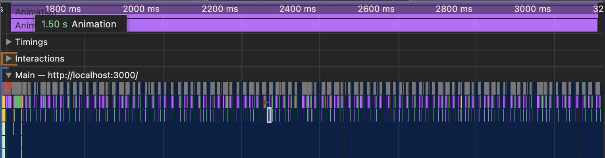

# 학습할 최적화 기법

- CSS 애니메이션 최적화
- 컴포넌트 지연 로딩
- 컴포넌트 사전 로딩
- 이미지 사전 로딩

# 서비스 탐색 및 코드 분석

이 서비스는 리우 올림픽과 런던 올림픽을 비교하는 단일 페이지로 이루어진 사이트이다.

여기서 눈여겨 볼 것은 "올림픽 사진 보기" 버튼이다.
버튼을 누르면 모달이 뜨면서 올림픽 사진을 캐러셀 형태로 보여준다.

이상한 건 이 사진이 로드되기 전에는 모달이 이상한 형태로 깨져있다는 것이다.


이것만 보았을 때 사진 사이즈가 너무 커서 늦게 로드되는 것으로 추측할 수 있다.
이런 현상은 이용에 불편을 주므로 반드시 최적화 해야한다.

"올림픽 사진 보기" 아래에는 설문 결과 항목이 있다.
설문 결과는 막대 그래프로 표시되어 있고

하나의 항목을 클릭하면 해당 답변에 응답한 사람들에 대해서만 필터링을 하여
그래프를 다시 보여준다.

그런데 새로운 결과를 보여줄 때 막대 길이가 애니메이션을 통해 변화하는데
어딘가 뚝뚝 끊기는 듯한 느낌이든다.

정확하게 판단하기는 어렵지만 더 부드럽다면 보기 좋을 것이다.
이 문제 역시 최적화 포인트로 자세히 다루어보자.

# 문제의 애니메이션 찾기

성능이 좋다면 크게 느껴지지 않을 것이다.
Performance 패널의 CPU 설정을 '6x slowdown'으로 설정하면
애니메이션 끊기는 현상을 더 쉽게 확인할 수 있다.


이런 끊김 현상을 쟁크( jank ) 라고한다.

#### 쟁크 현상이 왜 발생하는걸까?

코드에서 살펴 보았듯이 애니메이션을 일으키는 속성은 transition 이 적용된 width 속성일 뿐이다.

이 문제에 답하려면 먼저 브라우저 에서 애니메이션 이 어떻게 작동하는지,
그리고 브라우저에서 어떤 과정을 거쳐 화면을 그리는지 이해할 필요가 있다.

#### 애니메이션의 원리

애니메이션의 원리는 여러 장의 이미지를 빠르게 전환하여 우리눈에 잔상을 남기고,
그로 인해 연속된 이미지가 움직이는 것처럼 느껴지게 하는 것이다.

여러장의 이미지를 가지는 애니메이션 프레임이 다음과 같이 있다고 가정해보자.

`A-B-C-D-E-F`

그런데 만약 이 에니메이션에서 한 장의 이미지가 빠지면 어떻게 될까?

`A-B-C- -E-F`

어색하게 끊기는 느낌이 들 것이다.

다양한 주사율의 모니터가 있지만, 일반적으로 사요앟는 디스플레이의 주사율은 60Hz 이다.
즉 1초에 60장의 정지된 화면을 빠르게 보여준다는 의미이다.

따라서 브라우저도 이에 맞춰 최대 60FPS(Frames PEr Second)로 1초에 60장의 화면을 새로 그린다.

그렇다면 올림픽 통계 서비스의 막대 그래프 에니메이션에서 쟁크 현상이 발생한 이유도
브라우저가 정상적으로 60FPS로 화면을 그리지 못했기 때문이라고 유추해 볼 수 있다.

#### 왜 초당 60프레임을 제대로 그리지 못하는 것일까?

브라우저가 화면을 그리는 과정을 알아야한다.

`DOM + CSSOM > 렌더 트리 > 레이아웃 > 페인트 > 컴포지트`

위 과정을 거쳐 화면을 그린다.
이러한 과정을 주요 렌더링 경로(Critical Rendering Path) 또는
픽셀 파이프라인(Pixel Pipeline) 이라고 한다.

# 하드웨어 가속 (GPU 가속)

하드웨어 가속은 CPU에서 처리해야 할 작업을 GPU에 위임하여 더욱 효율적으로 처리하는 방법을 말한다.

GPU는 애초에 그래픽 작업을 처리하기 위해 만들어진 것이므로 화면을 그릴 때 활용하면 굉장히 빠르다.

특정 요소에 하드웨어 가속을 사용하려면 요소를 별도의 레이러로 분리하여 GPU로 보내야하는데,
transform, opacity 속성이 이 역할을 한다.

분리된 레이어는 GPU에 처리되어 레이아웃 단계와 페인트 단계 없이 화면상의 스타일을 변경할 수 있다.
따라서 위 속성을 사용했을 대 애니메이션 성능이 더 좋을 수 밖에 없다.

>transform: translate() 는 처음부터 레이어를 분리하지 않고 변화가 일어나느 순간 레이어를 분리한다.
>
>반면에 transform: translate3d() 또는 scale3d() 와 같은 3d 속성들,
>또는 will-change 속성은 처음부터 레이어를 분리해 두기 때문에 더욱 빠르게 대처할 수 있다.
>
>물론 레이어가 너무 많아지면 그만큼 메모리를 많이 사용하기 떄문에 주의해야한다.


# 애니메이션 최적화

Performance 패널을 열고 확인해보도록 하자.


width의 변경으로 인해 리플로우가 발생하였다.
화면을 갱신하는 시점인 회색 선을 넘어가는지도 살펴보자.

즉 화면을 1/60초 안에 그려서 보여줘야하는데
리플로우가 발생하여 모든 단계를 다시 밟느라 필요한 화면을 제때 그리지 못한것이다.

앞서 이야기하였던 GPU를 활용하여 최적화를 진행해보자.

```js
const BarGraph = styled.div`  
	/* 생략 */
	width: 100%;
	transform: scaleX(${({width}) => width / 100});
    transform-origin: center left;
	transition: transform 1.5s ease;
	/* 생략 */
```

최적화 전


최적화 후


확실히 최적화 후 메인스레드를 살펴보면 전보다 여유로워진 것을 볼 수 있다.
레이아웃과 페인트 작업이 생력되어, 포함된 작업도 더 적어진 것을 살펴볼 수 있다.


# 컴포넌트 지연 로딩

cra-bundle-analyzer 를 통해 번들 크기를 분석해보자.


살펴보면
`static/js/2.chunk.js`  블록은 node_modules에 있는 라이브러리 코드를 담고 있는 청크이고
오른쪽 파란색 블록은 올림픽 통계 서비스의 코드임을 알 수 있다.

그중 react-dom, styled-components 뿐만 아니라 react-image-gallery라는 라이브러리가 들어있다.


그리고 이 라이브러리에 커서를 올려 두면 대략적인 사이즈가 25KB (parsed size) 정도임을 알 수 있는데
사실 이 라이브러리는 첫 화면부터 필요하지 않는다.

이 라이브러리가 필요한 시점은 사진 갤러리가 있는 모달 창을 띄울 때 이다.

26KB가 큰 용량은 아니지만, 효율적으로 사용하기 위해
라이브러리 코드를 분할하고 지연로딩을 적용해보자.

#### 모달 코드 분리하기

```jsx
import React, { lazy, Suspense, useState } from 'react' 
const LazyImageModal = lazy(() => import('./components/ImageModal'))  
  
function App() {  
    const [showModal, setShowModal] = useState(false)  
  
    return (  
        <div className="App">  
            ...
            <Suspense fallback={null}>  
                {showModal ? (
	                <LazyImageModal
						closeModal={() => {
							setShowModal(false)
						}}
					/>
				) : null}  
            </Suspense>  
        </div>  
    )  
}
```

lazy와 Suspense를 통해 분리하고자 하는 컴포넌트에 적용한다.
Network 패널에서 살펴보면 "올림픽 사진보기" 이후에 분리된 js 파일이 로드되는 것을 확인할 수 있다.


cra-bundle-analyer로도 분석을 해보도록 하자.


결과를 확인해보니 파란색 블록으로 react-image-gallery 라이브러리가 분리되어 있고
하늘색 블록으로 ImageModal.js 가 분리되어있다.

한가지 특이한 점은 react-image-gallery만 분할될 것이라 생각했는데,
react-image-gallery에서 참조하고 있는 모든 라이브러리가 함께 묶여 분할되었다는 점이다.

덕분에 기대했던 26KB보다 많은 용량인 52KB가 분할되었다.

물론 모달의 코드가 그렇게 크지 않아 성능이 크게 다르게 느껴지지 않을 수도 있다.
하지만 나중에 더 많은 콘텐츠나 라이브러리가 들어간다면
지금 적용한 지연 로딩 기법이 꽤 의미있는 최적화 기법이 될 것이다.

# 컴포넌트 사전 로딩

#### 지연 로딩의 단점

컴포넌트 지연 로딩 기법을 적용해보았는데,

이 기법을 적용하면 최초 페이지를 로드할 때 모달과 관련된 코드가 번들에 포함되지 않아 초기 로딩 속도나 자바스크립트의 실행 타이밍이 빨라져 화면에 더 빨리 표시되는 장점이 있다.


하지만 초기 화면 로딩시에는 효과적일지 몰라도 모달을 띄우는 시점에는 한계가 있다.
모달 코드를 분리했기 때문에 모달을 띄울 때 네트워크를 통해 모달 코드를 새로  로드해야 하며
로드가 완료되어야만 모달을 띄울 수 있기 때문이다.

즉 모달이 뜨기까지의 약간의 지연이 발생한다는 것이다.
Performance 패널에서 확인해보도록 하자.


올림픽 사진보기 버튼을 클릭하여 일정 시간 이후 모달이 뜨는 과정을 기록한 내용이다.

살펴보면 클릭 시점과 모달이 뜨는 시점이 크게 차이가 나는 것을 확인할 수 있다.
이 문제를 어떻게 해결할까?

#사전로딩 (Preloading)기법을 이용하여 해결할 수 있다.

사전로딩은 나중에 필요한 모듈을 필요해지기 전에 미리 로드하는 기법이다.

앞의 모달 예시로 들어보면 모달 코드가 필요한 시점은 사용자가 버튼을 클릭하는 시점이다.
하지만 만약 사용자가 버튼을 클릭하기 전에 미리 모달 코드를 로드해두면 어떨까?

네트워크를 통해 코드를 불러오는 시간과 준비하는 데 드는 시간을 단축할 수 있어
빠르게 모달을 띄울 수 있을 것이다.

하지만 이 방법에는 한 가지 문제가 있다.
사용자가 버튼을 언제 클릭할지 모르니 모달 코드를 언제 미리 로드해둘지 정하기 애매하다는 것이다.

여기서 고려할 수 있는 타이밍이 두 가지 있다.

- 버튼 위에 마우스를 올려놓았을 때
- 최초 페이지가 로드되고 모든 컴포넌트가 마운트가 끝났을 때

# 컴포넌트 사전 로딩 타이밍

#### 버튼 위에 마우스를 올려 놓았을 때

```jsx
function App() {  
    const [showModal, setShowModal] = useState(false)  
  
    const handleMouseEnter = () => {  
        const component = import('./components/ImageModal');  
    }  
  
    return (  
        <div className="App">  
            <Header />  
            <InfoTable />  
            <ButtonModal onMouseEnter={handleMouseEnter} onClick={() => { setShowModal(true) }}>올림픽 사진 보기</ButtonModal>  
            <SurveyChart />  
            <Footer />  
            <Suspense fallback={null}>  
                {showModal ? <LazyImageModal closeModal={() => { setShowModal(false) }} /> : null}  
            </Suspense>  
        </div>  
    )  
}
```

이와 같이 onMouseEnter 이벤트를 통해 미리 모달 코드를 로드했기 때문에
딜레이 없이 모달을 띄울 수 있게 된다.

마우스 커서를 버튼위 올리고 클릭하기까지 대략 300~600밀리초 정도 시간 차가 있다.
아주 찰나의 순간이긴 하지만 브라우저가 새로운 파일을 로드하기에는 충분하다.


#### 컴포넌트 마운트 완료 후 사전 로딩

만약 모달 컴포넌트 크기가 커서 로드하는데 1초 또는 그 이상의 시간이 필요할 수도 있다.
이런 경우 마우스 커서를 버튼에 올렸을 때보다 더 먼저 파일을 로드해야한다.

이때 생각해 볼 수 있는 타이밍은 모든 컴포넌트의 마운트가 완료된 후로,
브라우저에 여유가 생겼을 때 뒤이어 모달을 추가로 로드하는 것이다.

클래스형 컴포넌트라면 componentDidMount 시점이겠고
함수형 컴포넌트에서는 useEffect 시점이라 할 수 있다.

```jsx
function App() {  
    const [showModal, setShowModal] = useState(false)  
  
    useEffect(() => {  
        const component = import('./components/ImageModal');  
    },[])  
  
    return (  
        <div className="App">  
            <Header />  
            <InfoTable />  
            <ButtonModal onClick={() => { setShowModal(true) }}>올림픽 사진 보기</ButtonModal>  
            <SurveyChart />  
            <Footer />  
            <Suspense fallback={null}>  
                {showModal ? <LazyImageModal closeModal={() => { setShowModal(false) }} /> : null}  
            </Suspense>  
        </div>  
    )  
}
```

이와 같이 코드를 작성하고 새로고침하면 모달에 대한 코드가 바로 로드되기는 하지만,
오른쪽 Waterfall에서 타임라인을 확인해보면 초기 페이지 로드에 필요한파일을 우선 다운로드하고
페이지가 완료된 후에야 모달 코드를 다운로드하고 있다.


두 가지 방법으로 사전 로딩 기법을 적용해보았다.

물론 사전 로딩 방법이 두 가지만 있는 것은 아니며, 서비스나 기능 특성에 따라 다양한 방법으로 적용할 수 있다. 중요한 것은 어느 타이밍에 사전 로드하는 것이 해당 서비스에서 가장 합리적인지 판단하는 일이다.

# 이미지 사전 로딩

#### 느린 이미지 로딩

이번에는 컴포넌트가 아닌 이미지를 사전로드해보자.

모달을 띄우고 이미지를 로드하려고 하는데 이미지 사이즈가 크다보니 다운로드 시간이 오래 걸려
다운로드가 완료될 때까지 아무것도 뜨지 않는다.

웹 개발을 할 때 흔히 발생하는 현상이라 다양한 해결 방법이 있다.
여기서는 화면에 제때 뜰 수 있도록 미리 다운로드 기법인 #이미지사전로딩 기법을 적용해본다.

#### 이미지 사전 로딩

컴포넌트는 import 함수를 이용해 로드했는데.
이미지는 이미지가 화면에 그려지는 시점,
HTML, CSS에서 이미지를 사용하는 시점에 로드된다.

하지만 이런 경우 외에 자바스크립트로 이미지를 직접 로드하는 방법이 한가지 있다.
바로 자바스크립트의 Image 객체를 사용하는 방법이다.

Image 객체는 다음과 같이 new 연산자를 이용하여 생성할 수 있다.
그런 다음 생성된 인스턴스의 src 속성에 원하는 이미지의 주소를 입력하면 해당 이미지를 로드할 수 있다.

```js
const img = new Image()
img.src = '{이미지 주소}'
```

브라우저 console 창에서 테스트해볼 수 있다.
src에 이미지가 할당되는 순간 Network 패널에서 해당 이미지가 다운로드되는 것을 볼 수 있다.

그럼 이 코드를 실제 코드에 적용해보도록 하자.
가장 먼저 보이는 이미지로 넣어준다.

```jsx
useEffect(() => {  
    const component = import('./components/ImageModal');  
    const img = new Image()  
    img.src = 'https://stillmed.olympic.org/media/Photos/2016/08/20/part-1/20-08-2016-Football-Men-01.jpg?interpolation=lanczos-none&resize=*:800';  
},[])
```

이렇게 처리한 후 Network 패널을 살펴보면 모달 코드와 함께 이미지가 다운로드되는 것을 볼 수 있다.
즉 나중에 모달 위에 표시될 대표 이미지를 미리 다운로드한 것이다.


이후 모달을 열면 대표 이미지가 바로 보이는 것을 확인할 수 있다.

여기서 추가로 고민할 것은 몇장의 이미지까지 사전 로드해 둘 것인가이다.
대표 이미지 뿐만 아니라 하단 섬네일 이미지도 있기 때문이다.

섬네일 이미지까지 사전 로딩할 수도 있지만 그렇게 하면  페이지가 로드될 떄,
즉 사전로딩을 하는 순간 리소스를 그만큼 많이 사용하기 때문에 다른 성능 문제를 야기할 수도있다.

따라서 어떤 콘텐츠를 사전 로드할 때는 정말 사전 로딩이 필요한지 고민해야 한다.

여기서는 가장 중요하다고 판단되는 첫 대표 이미지 한장만 사전로드 하였고
그외 섬네일 이미지는 중요하다 생각치 않아 사전로드하지 않았다.

