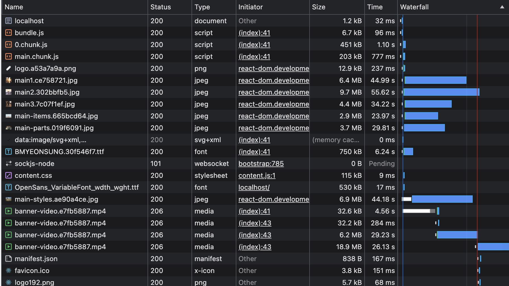
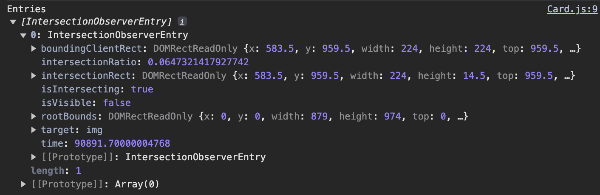
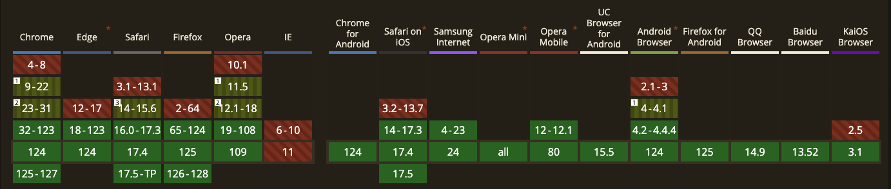
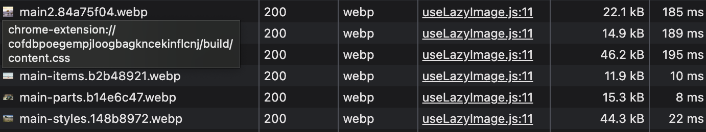
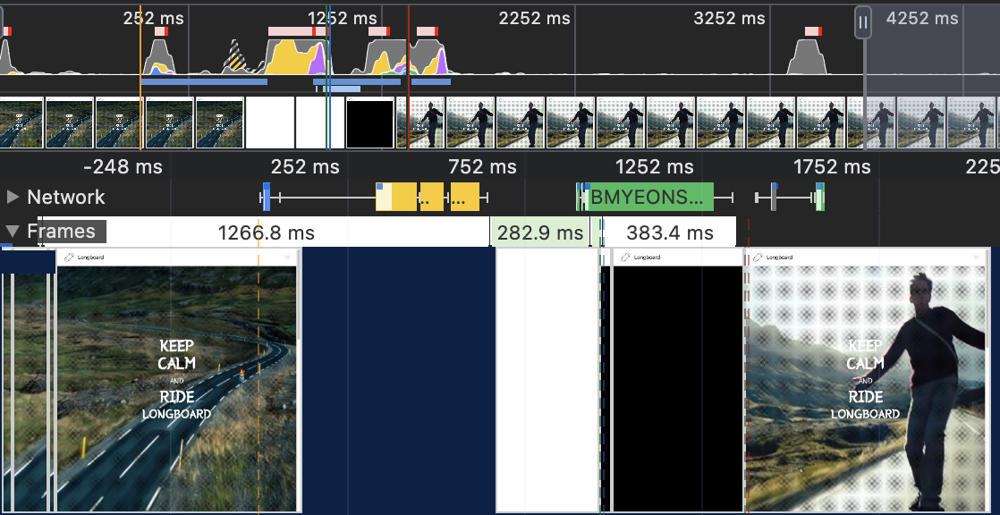

# 학습할 최적화 기법

#### 이미지 지연 로딩

말 그대로 첫 화면에 당장 필요하지 않은 이미지가 먼저 로드되지 않도록 지연시키는 기법
사용자에게 가장 먼저 보이는 콘텐츠를 더 바르게 로드할 수 있다.

#### 이미지 사이즈 최적화

Unsplash에서 제공하는 CDN이 아닌 서버에 저장되어 있는 정적 이미지를 최적화해본다.

#### 폰트 최적화

기본 폰트만 사용하면 문제가 없겠지만, 커스텀 폰트를 적용하려고 한다면 몇 가지 성능을 야기할 수 있다. 커스텀 폰트를 적용할 때 발생할 수 있는 문제를 알아보고 최적화해본다.

#### 캐시 최적화

자주 사용되는 리소스를 브라우저에 저장해두고, 다음번에 사용할 때 새로 다운로드하지 않고 저장되어 있는 것을 사용하는 기술을 적용해본다.

#### 불필요한 CSS 제거

불필요한 코드(JS, CSS)가 빌드되는 경우가 있다.
CSS 코드가 서비스 코드에 포함되어 있을 경우 해당 코드를 제거하여 파일 사이즈를 줄이는 방법에 대해 알아본다.

# 분석 툴

#### 크롬 개발자 도구 Coverage 패널

- 웹 페이지를 렌더링하는 과정에서 어떤 코드가 실행되었는지 보여준다.
- 각 파일의 코드가 얼마나 실행됐는지 비율로 나타내준다.
- 특정 파일에서 극히 일부 코드만 실행되었다면(퍼센티지가 낮다면) 해당 파일에 불필요한 코드가 많이 포함되어 있다고 볼 수 있다.

#### Squoosh

- 웹에서 서비스되는 이미지 압축 도구
- 구글에서 만들었으며, 간편하게 이미지의 포맷이나 사이즈를 변경할 수 있다.

#### PurgeCSS

- 사용하지 않는 CSS를 제거해주는 툴
- CLI를 통해 실행하거나 webpack과 같은 번들러에서 플러그인으로 추가하여 사용

# 서비스 탐색 및 코드 분석

서비스는 일반적인 홈페이지 구조이다.
첫 페이지에 커다란 동영상 배너와 함께 커스텀 폰트가 적용된 텍스트가 있다.
그 아래로는 롱보드에 대한 간략한 소개와 각 페이지로 이동하는 버튼이 존재한다.

스타일링은 Tailwind CSS를 사용하고 있다.
서버는 Express로 간단하게 구현되어 있다.

# 이미지 지연 로딩

#### 네트워크 분석

서비스를 분석하고 최적화할 때 어떤 작업을 먼저 해야 한다는 규칙은 없다.
상황에 따라 원하는 분석을 진행하면 된다.

여기서는 네트워크를 먼저 살펴본다.

Network Throttling 옵션에 Add 를 선택하여 원하는 throttling 옵션을 설정할 수 있다.


6000이라는 이름, 다운로드와 업로드 속도를 6000kb/s로 설정하여 진행한다.
참고로 기본적으로 설정되어있는 Fast 3G와 Slow 3G 속도는 다음과 같다.

|               | Fast 3G  | Slow 3G |
| ------------- | -------- | ------- |
| 다운로드 속도 | 1500kb/s | 780kb/s |
| 업로드 속도   | 780kb/s  | 330kb/s |

추가한 옵션으로 throttling을 적용하고 네트워크 분석을 진행해보자.



당장 중요한 리소스인 bundle 파일이 다운로드되는 것을 볼 수 있고
main1, 2, 3 이미지와 폰트가 다운로드 되는 것을 볼 수 있다.

그리고 한동안 banner-video 파일이 pending상태(하얀 막대)로 존재하다가
일부 리소스(main-items.jpg)의 다운로드가 완료된 후에 다운로드되는 것을 볼 수 있다.

그런데 banner-video는 페이지에서 가장 처음으로 사용자에게 보이는 콘텐츠인데 가장 나중에 로드되면,
사용자가 첫 화면에서 아무것도 보지 못한 채로 오랫동안 머물게 되므로 사용자 경험에 좋지 않을 것이다.

**이 문제를 어떻게 해결할 수 있을까?**

동영상 다운로드를 방해하는 사용되지 않는 이미지를 나중에 다운로드되도록 하여 동영상이 먼저 다운로드하게 변경하면 될 것이다.

즉, 이미지를 지연로드 시킨다.

**이 이미지들을 페이지가 로드될 때 로드하지 않는다면 언제 로드해야할까?**

바로 이미지가 화면에 보이는 순간 또는 그 직전에 이미지를 로드해야할 것이다.

즉, 뷰포트에 이미지가 표시될 위치까지 스크롤 되었을 때

# Intersection Observer

뷰포트에 이미지를 보이게 할지 판단해야하는데,
scroll 이벤트를 적용하여 throttle과 같은 방식으로 처리할 수 있지만 근본적인 해결 방법이 될 수는 없다.

이런 스크롤 문제를 해결할 수 있는 방법이 있다.
Intersection Observer는 브라우저에서 제공하는 API이다.
이를 통해 웹 페이지의 특정 요소를 관찰하면 페이지 스크롤 시,
해당 요소가 화면에 들어왔는지 아닌지 알려준다.

즉 스크롤 이벤트처럼 스크롤할 때마다 함수를 호출하는 것이 아니라
요소가 화면에 들어왔을 때만 함수를 호출하는 것

성능면에서 scroll 이벤트로 판단하는 것보다 훨씬 효율적이다.

```js
const options = {
	/*
		객체의 가시성을 확인할 때 사용되는 뷰포트 요소
		기본값 null
		null로 설정 시 브라우저의 뷰포트로 설정된다.
	*/
	root: null,
	/*
		root 요소의 여백
		root의 가시 범위를 가상으로 확장하거나 축소할 수 있다.
	*/
	rootMargin: '0px',
	/*
		가시성 퍼센티지
		대상 요소가 어느정도로 보일 때 콜백을 실행할지 결정한다.
		1.0으로 설정하면 대상 요소가 모두 보일 때 실행되며,
		0으로 설정하면 1px이라도 보이는 경우 콜백이 실행된다.
	*/
	threshold: 1.0,
}

// 가시성이 변경될 때마다 실행되는 함수
const callback = (entries, observer) => {
	console.log('Entries', entries)
}

// observer 인스턴스
const observer = new InterectionsObserver(callback, options)

observer.observe(document.querySelector('#target-element1'))
observer.observe(document.querySelector('#target-element2'))
```


# Intersection Observer 적용하기

나란히 렌더링 되는 이미지 3장에 지연로딩을 적용해보자.

```jsx
// 적용 전
function Card(props) {  
    return (  
       <div className="Card text-center">  
            
          <div className="p-5 font-semibold text-gray-700 text-xl md:text-lg lg:text-xl keep-all">  
             {props.children}  
          </div>  
       </div>  
    )  
}  
```

```jsx
// 적용후
function Card(props) {  
    const imgRef = useRef(null)  
  
    useEffect(() => {  
       const options = {}  
       const callback = (entries, observer) => {  
          entries.forEach(entry => {  
             if(entry.isIntersecting) {  
                entry.target.src = entry.target.dataset.src  
                observer.unobserve(entry.target)  
             }  
          })  
       }  
  
       const observer = new IntersectionObserver(callback, options)  
  
       observer.observe(imgRef.current)  
  
       return () => observer.disconnect()  
    },[])  
  
    return (  
       <div className="Card text-center">  
            
          <div className="p-5 font-semibold text-gray-700 text-xl md:text-lg lg:text-xl keep-all">  
             {props.children}  
          </div>  
       </div>  
    )  
}
```




로그를 찍어서 살펴보면 3개의 로그가 출력된다.
그중 중요한 값은 `isIntersectiong` 값이다.

이 값은 해당 요소가 뷰포트 내에 들어왔는지를 나타내는 값이다.
이 값을 통해 요소가 화면에 보이는지 나간 것인지 알 수 있다.

이미지가 보이는 순간, 즉 콜백이 실행되는 순간 이미지를 로드하도록 변경해보자.
이미지 로딩은 img 태그에 src가 할당되는 순간 일어난다.

따라서 최초에는 img 태그에 src 값을 할당하지 않다가 콜백이 실행되는 순간
src를 할당함으로써 이미지 지연 로딩을 적용할 수 있다.

여기서는 data-src에 주소를 넣어두었다가 src로 옮겨 이미지를 로드하였다.
한번 이미지 로드 후에 다시 호출할 필요가 없으므로 `observe` 를 호출하여 observe를 해제한다.

# 이미지 사이즈 최적화

#### 느린 이미지 로딩 분석

앞서 배너의 동영상 콘텐츠가 별다른 지연 없이 바로 다운로드 할 수 있도록
이미지 지연 로딩을 적용하였다.

**하지만 막상 이미지가 로드되는 속도는 굉장히 느리다.**

로드되면서 이미지가 잘려보이기 까지 하는데, 이는 서비스가 느리다는 느낌을 줄 수 있다.

Network 패널을 통해 이미지 크기를 살펴보면, 파일 크기가 매우 큰 것을 볼 수 있다.


이렇게 이미지 사이즈가 크면 다운로드에 많은 시간이 걸리고 다른 작업에 영향을 준다.
이미지 사이즈 최적화를 진행해보자.

#### 이미지 포맷 종류

이미지 사이즈 최적화는 간단히 말하면
가로, 세로 사이즈를 줄여 이미지 용량을 줄이고 그 만큼 더 빠르게 다운로드하는 기법이다.

이미지의 사이즈를 줄이기 전에, 이미지를 잘 다루기 위해 짚고 넘어가야 할 것이 있다.
**바로 이미지의 포맷이다.**

SVG와 같은 벡터 이미지가 아닌 비트맵 이미지 포맷 중 대표적인 세가지 포맷을 살펴보자.

- PNG
    - 무손실 압축 방식
    - 원본을 훼손 없이 압축
    - 알파 채널을 지원
- JPG(JPEG)
    - 압축과정에정보 손실 발생 (더 작은 사이즈로 줄일 수 있다.)
    - 고화질이어야 하거나 투명정보가 필요한게 아니면 JPG 권장
- WebP
    - 무손실 압축과 손실 압축을 모두 제공하는 최신 이미지 포맷
    - PNG,JPG에 비해 대단히 효율적으로 이미지를 압축할 수 있다.
    - 공식문서에 따르면 WebP 방식은 PNG 대비 26% JPG 대비 25~34% 더 나은 효율을 가지고 있다고 한다.

위 내용을 살펴보면 WebP를 사용하는 것이 마냥 좋을 것 같다.
하지만 간단한 문제는 아니다.

이유는 바로 브라우저 호환성 때문인데
꽤나 최신 이미지 파일 포맷이라서 아직 지원하지 않는 브라우저도 있다.

- 사이즈 : PNG > JPG > WebP
- 화질 : PNG = WebP > JPG
- 호환성 : PNG = JPG > WebP



#### Squoosh를 사용하여 이미지 변환

WebP 포맷으로 변환하여 고화질, 저용량의 이미지로 최적화해보도록 하자.

그러러면 이미지를 변환해주면 컨버터가 필요한데,
여기서 사용할 컨버터는 바로 Squoosh라는 애플리케이션이다.

Squoosh는 구글에서 만든 이미지 컨버터 웹 애플리케이션이다.

별도의 프로그램 설치 없이 웹에서 이미지를 손쉽게 여러 가지 포맷으로 변환할 수 있고,
원본과 비교하는 등 다양한 기능을 이용할 수 있다.

resize를 통해 600x600 사이즈로 변경하고 WebP로 변환하여 적용해보도록 하자.



이미지 사이즈를 Network 탭에서 확인해보면 다운로드 시간도 상당히 짧아진 것을 볼 수 있다.

문제는 WebP로만 이미지를 렌더링할 경우 특정 브라우저에서는 제대로 렌더링되지 않을 수 있다는 것인데, 이런 문제를 해결하려면 단순 Img 태그로만 이미지를 렌더링하면 안되며, picture 태그를 사용해야한다.

picture 태그는 다양한 타입의 이미지를 렌더링하는 컨테이너로 사용된다.
예를 들어 아래 코드처럼 브라우저 사이즈에 따라 지정된 이미지를 렌더링하거나 지원되는 타입의 이미지를 찾아 렌더링한다.

```jsx
// 뷰포트에 따라 구분
<picture>
	<soruce media="(min-width:650px)" srcset="img_pink_flowers.jpg" />
	<soruce media="(min-width:465px)" srcset="img_white_flower.jpg" />
	
</picture>
// 이미지 포맷에 따라 구분
<picture>
	<soruce srcset="photo.avif" type="image/avif" />
	<soruce srcset="photo.webp" type="image/webp" />
	
</picture>
```

picture 태그를 사용하여 브라우저가 WebP를 렌더링하지 못할 때 JPG 이미지로 렌더링하도록 수정해보자.

```jsx
function Card(props) {  
    const imgRef = useLazyImageLoad();  
    return (  
       <div className="Card text-center">  
          <picture>  
             <source data-srcset={props.webp} type="image/webp" />  
               
          </picture>  
          <div className="p-5 font-semibold text-gray-700 text-xl md:text-lg lg:text-xl keep-all">  
             {props.children}  
          </div>  
       </div>  
    )  
}
```

가장 상위에 있는 WebP를 우선으로 로드하고, 브라우저가 WebP를 지원하지 않으면 img 태그에 있는 JPG 이미지를 렌더링한다.

최적화 전후를 Network 탭에서 직접 로딩 속도를 비교해보도록 하자.

# 동영상 최적화

**동영상 콘텐츠 분석**

Network 패널 에서 살펴보면 이미지처럼 하나의 요청으로 모든 영상을 다운로드하지않는다.
콘텐츠의 특성상 파일 크기가 크기 때문에 당장 재생이 필요한 앞부분을 먼저 다운로드한 뒤
순차적으로 나머지 내용을 다운로드한다.

그래서 동영상 콘텐츠의 다운로드 요청이 여러 개로 나뉘어 있는 것이다.

하지만 역시 문제가 있다.
아무리 여러 번 나눠서 다운로드를 해도 애초에 동영상 파일이 크다보니 재생하기 까지 꽤 오래 걸린다.



Performance 패널을 통해 확인해보면 일정 시간 동안 동영상 콘텐츠가 다운로드되고, 그 이후에야 재생이 되는 것을 볼 수 있다.

동영상 파일 크기도 확인해보면 54MB인 것을 알 수 있다.

**동영상 압축**

동영상 최적화도 이미지와 비슷하다.
가로,세로 사이즈를 줄이고 압축 방식을 변경하여 동영상의 용량을 줄이는 것

물론 동영상에는 프레임 레이트(frame rate)등 이미지보다는 복잡한 설정이 있지만 그 정도까지 알 필요는 없다.

여기서는 단순히 압축하는 툴을 활용하여 최적화를 진행한다.

>동영상이 메인 콘텐츠인 서비스에서는 이 작업을 추천하지 않는다.

[Media.io](https://www.media.io/ko/convert/mp4-to-webm.html) 서비스를 사용하여 비디오를 압축한다.

Bitrate는 제일 낮은 512Kbps로 설정하고 WebM 포맷으로 변환한다.
또 오디오는 사용하지 않으니 제거한다.

>Bitrate는 특정 시간 단위마다 처리하는 비트의 수로 동영상에서는 1초에 얼마나 많은 정보를 포함하는가를 의미한다. 따라서 이 값이 크면 1초에 더 많은 정보를 포함하게 되므로 화질은 좋아지지만 파일의 사이즈는 커진다.

다운로드하여 적용해보록 하자.

**최적화 전후 비교**

Performance 패널로 분석해보면 동영상이 이전과 달리 매우 빠르게 로드되고 재생되는 것을 확인할 수 있다. 사이트에서 직접 새로고침을 해서 눈으로 확인해 봐도 큰 끊김 없이 영상이 로드되고 재생되는 것을 볼 수 있다.

> 팁
> 변환 후 화질이 전환되었는데 패턴을 적용하거나 필터를 씌워 좋지 화질이 좋지 않음을 인지할 수 없다.
> 혹은 css의 blur를 통해 흐림 효과를 적용해보도록 하자.

---

# 폰트 최적화

#### FOUT, FOIT

폰트의 변화로 발생하는 이 현상을
FOUT(Flash of Unstyled Text) 또는
FOIT(Flash of Invisible Text)라고 한다.

FOUT
- Edge 브라우저에서 폰트를 로드하는 방식
- 폰트의 다운로드 여부와 상관없이 먼저 텍스트를 보여준 후 폰트가 다운로드되면 그때 폰트를 적용하는 방식

FOIT
- 크롬, 사파리, 파이어폭스 등에서 폰트를 로드하는 방식
- 폰트가 완전히 다운로드되기 전까지 텍스트 자체를 보여주지 않는다.
- 다운로드가 완료되면 폰트가 적용된 텍스트를 보여준다.
  - 크롬에서 테스트해보면 폰트가 다운로드 되지 않았는데 텍스트가 보인다.
  - 완전한 FOIT가 아니라 3초만 기다리는 FOIT이기 때문

어떤 방식이 더 낫다고 말할 순 없다. 상황에 따라 더 적절한 방법이 있는 것이다.
중요한 것은 최대한 최적화해서 폰트 적용 시 발생하는 깜박임 현상을 최소화하는 것

# 폰트 최적화 방법

폰트 최적화 방법은 크게 두 가지가 있다.

#### 폰트 적용 시점을 제어하는 방법

font-display는 @font-face에서 설정할 수 있고 다음 값을 갖는다.

- auto: 브라우저 기본 동작 (기본 값)
- block: FOIT (timeout = 3s)
- swap: FOUT
- fallback: FOIT (timeout = 0.1s) / 3초 후에도 불러오지 못한 경우 기본 폰트로 유지, 이후 캐시
- optional: FOIT (timeout = 0.1s) / 이후 네트워크 상태에 따라 기본 폰트로 유지할지 결정, 이후 캐시

이 속성을 이용하면 FOUT 방식으로 폰트를 렌더링하는 Edge에 FOIT 방식을 적용하거나,
FOIT 방식으로 폰트를 렌더링하는 크롬에 FOUT 방식을 적용할 수 있다.

fallback
- 3초 후에도 폰트를 다운로드하지 못한 경우, 폰트가 다운로드되더라도 폰트를 적용하지 않고 캐시해 둔다.
  - 최초 페이지 로드에서 폰트 다운로드가 늦으면 적용되지 않은 모습이 계속 보일 것이다.
  - 하지만 페이지를 다시 로드했을 때는 캐시되어 있으므로 바로 적용된 텍스트를 볼 수 있다.

optional
- 3초가 아니라 사용자의 네트워크 상태를 기준으로 폰트를 적용할지 기본 폰트로 유지할지 결정한다.

```css
@font-face {
	font-family: BMYEONSUNG;
	src: url('./assets/fonts/BMYEONSUNG.ttf');
	font-display: fallback;
}
```

이처럼 font-display 속성을 이용해서 폰트가 적용되는 시점을 제어할 수 있다.

여기서는 FOIT 방식인 block을 사용한다.
한가지 문제점은 block 옵션을 설정하면 안보이던 폰트가 갑자기 나타나서 조금 어색할 수도 있다.
이 문제를 해결하기 위해 페이드 인(fade-in) 애니메이션을 적용해 보려고 한다.

폰트 다운로드 완료 시점을 알아야하는데
폰트의 다운로드 시점은 `fontfaceobserver` 라이브러리를 통해 알 수 있다.

설치 후 폰트가 사용되는 배너에 다음과 같이 적용해보자.

```jsx
import React, { useEffect, useState } from 'react'  
import FontFaceObserver from 'fontfaceobserver'  
import video from '../assets/banner-video.webm'  
  
const font = new FontFaceObserver('BMYEONSUNG')  
  
function BannerVideo() {  
    const [isFontLoaded, setIsFontLoaded] = useState(false)  
    
	useEffect(() => {  
       font.load(null, 20000).then(() => {  
          setIsFontLoaded(true)  
       })  
    }, []);
    
    return (  
       <div className="BannerVideo w-full h-screen overflow-hidden relative bg-texture">  
          <div className="absolute h-screen w-full left-1/2">  
             <video src={video} className="absolute translateX--1/2 h-screen max-w-none min-w-screen -z-1 bg-black min-w-full min-h-screen" autoPlay loop muted/>  
          </div>  
          <div  
             className="w-full h-full flex justify-center items-center"  
             style={{  
                opacity: isFontLoaded ? 1 : 0,  
                transition: 'opacity 0.3s ease'  
             }}  
          >  
             <div className="text-white text-center">  
                <div className="text-6xl leading-none font-semibold">KEEP</div>  
                <div className="text-6xl leading-none font-semibold">CALM</div>  
                <div className="text-3xl leading-loose">AND</div>  
                <div className="text-6xl leading-none font-semibold">RIDE</div>  
                <div className="text-5xl leading-tight font-semibold">LONGBOARD</div>  
             </div>  
          </div>  
       </div>  
    )  
}  
  
export default BannerVideo
```

텍스트가 로드될 때 애니메이션 효과와 함께 나타날 것이다.

#### 폰트 사이즈를 줄이는 방법

폰트 파일 크기를 줄이는 방법에는 두 가지가 있다.
- 압축률이 좋은 폰트 포맷을 사용
- 필요한 문자의 폰트만 로드하는 것

**폰트 포맷별 파일 크기 비교**

>EOF > TTF/OTF > WOFF > WOFF2

WOFF, WOFF가 베스트일 것 같지만, 브라우저 호환성 문제가 있다.

모던 브라우저에서는 정상적으로 사용할 수 있지만, 버전이 낮은 일부 브라우저에서는 해당 포맷을 지원하지 않을 수 있다.

그렇기에 지원하는 정도에 따라 WOFF2 > WOFF > TTF 를 순차적으로 적용하도록 구현해보자.

[transfonter.org](https://transfonter.org/) 에서 폰트를 변환하여 폰트 파일을 준비하도록 하자.

그리고 다음과 같이 적용한다.

```css
@font-face {  
    font-family: BMYEONSUNG;  
    src: url('./assets/fonts/BMYEONSUNG.ttf') format('woff2'),  
       url('./assets/fonts/BMYEONSUNG.ttf') format('woff'),  
       url('./assets/fonts/BMYEONSUNG.ttf') format('truetype');  
    font-display: block;  
}
```

작성 후 Network 패널을 살펴보면 WOFF2 폰트가 로드되는 것을 볼 수 있다.


**서브셋 폰트 사용**

동일하게 [transfonter.org](https://transfonter.org/) 에서 폰트를 변환하여 서브넷 폰트를 만들 수 있다.
적용하면 다음과 같다.

```css
@font-face {  
    font-family: BMYEONSUNG;  
    src: url('./assets/fonts/subset-BMYEONSUNG.woff2') format('woff2'),  
       url('./assets/fonts/subset-BMYEONSUNG.woff') format('woff'),  
       url('./assets/fonts/subset-BMYEONSUNG.ttf') format('truetype');  
    font-display: block;  
}
```

더 개선하면 다음과 같이도 적용 가능하다.

```css
@font-face {  
    font-family: BMYEONSUNG;  
    src: url('data:font/woff2;charset=utf-8;base64,...') format('woff2'),  
       url('./assets/fonts/subset-BMYEONSUNG.woff') format('woff'),  
       url('./assets/fonts/subset-BMYEONSUNG.ttf') format('truetype');  
    font-display: block;  
}
```

폰트 파일이 기존과 달리 Data-URI 형태로 로드되는 것을 볼 수 있다.
확인해보면 시간이 매우 짧다.

기본적으로 브라우저에서 Data-URI를 네트워크 트래픽으로 인식해서 기록하지만
실제로는 이미 다른 파일 내부에 임베드되어 있어 별도의 다운로드 시간이 필요하지 않는다.
그래서 시간이 매우 짧은 것이다.

Timing 탭을 살펴봐도 다운로드 시간이 고려하지 않아도 될 만큼 작음을 알 수 있다.

# 캐시 최적화

#### 캐시란?

캐시는 간단히 말하면 자주 사용하는 데이터나 값을 미리 복사해 둔 임시 저장 공간 또는 저장하는 동작이다. 웹에서는 서비스에서 사용하는 리소스 파일을 매번 네트워크를 통해 불러오지 않고 최초에만 다운로드하여 캐시에 저장해 두고 그 이후 요청 시에는 저장해 둔 파일을 사용한다.

#### 캐시의 종류

웹에서 사용하는 캐시는 크게 두 가지로 구분할 수 있다.

- 메모리 캐시
  - 메모리에 저장하는 방식
  - 여기서 메모리는 RAMdmf dmlalgksek.
- 디스크 캐시
  - 파일 형태로 디스크에 저장하는 방식

어떤 캐시를 사용할지는 직접 제어할 수 없다.
브라우저가 사용 빈도나 파일 크기에 따라 특정 알고리즘에 의해 알아서 처리한다.

직접 확인해 보는 방법은 Network 패널을 확인해 보면 Size 항목에 memory cache 또는
disk cache라고 표시된 것을 볼 수 있다.

이 리소스들이 브라우저에 캐시된 리소스이다.
**캐시를 확인할 때는 Network 패널의 Disable cache 설정을 꺼야한다.**

캐시가 적용된 리소스의 응답 헤더를 보면 Cache-Control 이라는 헤더가 들어있는 것을 볼 수 있다.
이 헤더는 서버에서 설정되며, 이를 통해 브라우저는 해당 리소스를 얼마나 캐시할지 판단한다.

#### Cache-Control

리소스의 응답 헤더에 설정되는 헤더이다.
브라우저는 서버에서 이 헤더를 통해 캐시를 어떻게, 얼마나 적용해야 하는지 판단한다.
Cache-Control에는 대표적으로 아래 5가지 값이 조합되어 들어간다.

- no-cache: 캐시를 사용하기 전 서버에 검사 후 사용
- no-store: 캐시 사용 안함
- public: 모든 환경에서 캐시 사용 가능
- private: 브라우저 환경에서만 캐시 사용, 외부 캐시 서버에서는 사용 불가
- max-age: 캐시의 유효 시간

# 캐시 적용

응답 헤더에서 Cache-Control 헤더를 통해 설정된다고 했다.
중요한 것은 응답 헤더는 서버에서 설정해준다는 것이다.

여기서는 노드 서버를 사용한다.

헤더 설정을 다음과 같이 변경한다.

```js
const header = {  
    setHeaders: (res, path) => {  
        res.setHeader('Cache-Control', 'max-age=10')  
        res.setHeader('Expires', '-1')  
        res.setHeader('Pragma', 'no-cache')  
    },  
}
```

적용하여 실행된 서비스에서 새로고침을 몇 번 하면 Network 패널을 살펴보면 리소스들이 캐시되는 것을 볼 수 있다.
- Size의 memory cache
- 추가된 Cache-Control 헤더 : max-age=10

하지만 10초가 지난 후 다시 새로고침해보면 조금 다른 모습으로 기록되는 것을 볼 수 있다.

캐시 유효 시간이 만료되면서 브라우저는 기존에 캐시된 리소스를 그대로 사용해도 될지, 아니면 리소스를 새로 다운로드해야 할지 서버에 확인하기 때문이다.

# 적절한 캐시 유효 시간

앞서 적용한 방식은 모든 리소스에 동일한 캐시 설정이 적용되기 때문에 효율적이지 않다.
리소스마다 사용이나 변경 빈도가 달라 캐시의 유효 시간도 달라져야 하기 때문이다.

일반적으로 HTML파일에는 no-cache 설정을 적용한다.
- 항상 최신 버전의 웹 서비스를 제공하기 위함

JS와 CSS는 다르다. 빌드된 자바스크립트와 CSS는 파일명에 해시를 함께 가지고 있다.
즉 코드가 변경되면 해시도 변경되어 다른 파일이 되어버린다.

캐시를 아무리 오래 적용해도 HTML만 최신 상태라면 JS, CSS 파일은 당연히 최신 리소스를 로드할 것이다. 이미지도 마찬가지이다.

정리해보면 다음과 같다.

- HTML : no-cache
- JS : public, max-age=31536000
- CSS : public, max-age=31536000
- IMG : public, max-age=31536000

그럼 이 값으로 다시 코드를 수정해보자.
파일 종류는 path, endsWith 메서드를 이용하여 구분할 수 있다.

```js
// html 은 no-cache
// JS,CSS,,WebP 파일에는 캐시를 적용
// 그 외 파일들은 no-store로 캐시를 적용하지 않는다.

const header = {  
    setHeaders: (res, path) => {  
        if(path.endsWith('.html')) {  
            res.setHeader('Cache-Control', 'no-cache')  
        } else if (path.endsWith('.js') || path.endsWith('.css') || path.endsWith('.webp')) {  
            res.setHeader('Cache-Control', 'public, max-age=31536000')  
        } else {  
            res.setHeader('Cache-Control', 'no-store')  
        }  
    },  
}
```

# 불필요한 CSS 제거

Coverage 패널을 통해 확인해보면 CSS 리소스 파일의 커버리지가 99%로 나온다.
실제 CSS 코드를 살펴보면 많은 유틸 클래스가 사용되지 않았음을 알 수 있다.
이 클래스 모두 Tailwind CSS 라이브러리에서 추가된 것으로,
개발할 때는 미리 만들어진 클래스를 통해 쉽고 빠르게 스타일을 적용할 수 있다는 장점이 있었지만
막상 빌드하고 나니 사용하지 않은 스타일도 함께 빌드되어 파일의 사이즈를 크게 만든다는 단점이 있다.

이런 사용하지 않는 CSS 코드를 어떻게 제거할 수 있을까?

# PurgeCSS

사용하지 않는 CSS 코드를 제거하는 방법은 여러 가지가 있겠지만, 여기서는 PurgeCSS라는 툴을 사용하여 해결해본다.

PurgeCSS는 파일에 들어 있는 모든 키워드를 추출하여 해당 키워드를 이름으로 갖는 CSS 클래스만 보존하고 나머지 매칭되지 않은 클래스는 모두 지우는 방식으로 CSS 파일을 최적화한다.

사용 방법은 간단하다.

```bash
npm install --save-dev purgecss
```

키워드를 추출하고자 하는 파일과 불필요한 클래스를 제거할 CSS 파일을 지정하면 된다.

```bash
purgecss --css ./build/static/css/*.css --output ./build/static/css/ --content ./build/index.html ./build/static/js/*.js
```

불필요한 클래스를 제거할 CSS로 빌드된 CSS 파일을 선택하였고
아웃풋으로는 동일한 위치를 지정함으로 써 새로운 파일을 생성하는 대신 기존 CSS 파일을 덮어 쓰도록 했다.

그리고 키워드를 추출할 파일(--content)로는 빌드된 HTML과 자바스크립트 파일의 전부를 넣어주었다.

이렇게 하면 빌드된 HTML과 JS파일의 텍스트 키워드를 모두 추출하여 빌드된 CSS 파일의 클래스와 비교하고 최적화하게 된다.

```json
"scripts": {  
  "start": "npm run build:style && react-scripts start",  
  "build": "npm run build:style && react-scripts build",  
  "build:style": "postcss src/tailwind.css -o src/styles.css",  
  "serve": "node ./server/server.js",  
  "server": "node ./node_modules/json-server/lib/cli/bin.js --watch ./server/database.json -c ./server/config.json",  
  "purge": "purgecss --css ./build/static/css/*.css --output ./build/static/css/ --content ./build/index.html ./build/static/js/*.js"  
},
```

다음과 같이 스크립트로 추가하여 사용한다.

실행해보면 별 메시지 없이 실행된다, 하지만 재시작후 Coverage 패널을 살펴보면 이전과 달리 CSS 파일의 사이즈와 사용되지 않은 코드의 비율이 달라진 것을 볼 수 있다.

매칭되지 않은 클래스가 제거된 것이다.

문제가 해결된 것 같지만, 막상 서비스를 살펴보면 일부 스타일이 제대로 적용되지 않은 것처럼 보인다.
텍스트 키워드를 추출할 때 콜론(:) 문자를 하나의 키워드로 인식하지 못하고 잘라 버렸기 때문에 생기는 현상이다.

이 문제는 PurgeCSS의 defaultExtractor 옵션을 통해 해결할 수 있다.

```js
// purgecss.config.js
module.exports = {
	defaultExtractor: content => content.match(/[\w:\-]+/g) || []
}
```

그리고 아래와 같이 스크립트에 파일 경로를 지정하면 된다.

```bash
purgecss --css ./build/static/css/*.css --output ./build/static/css/ --content ./build/index.html ./build/static/js/*.js
```
